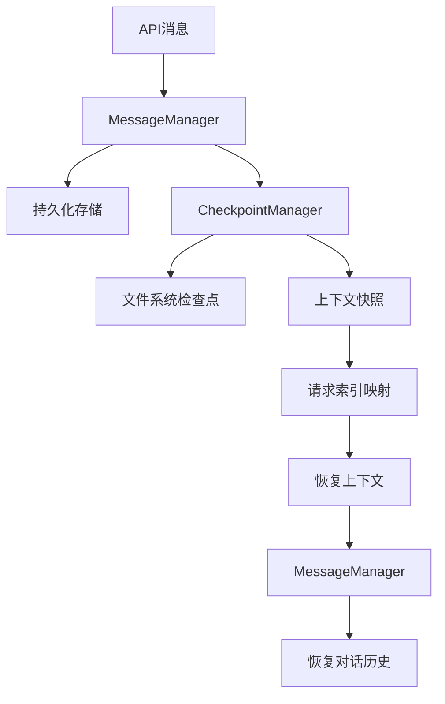
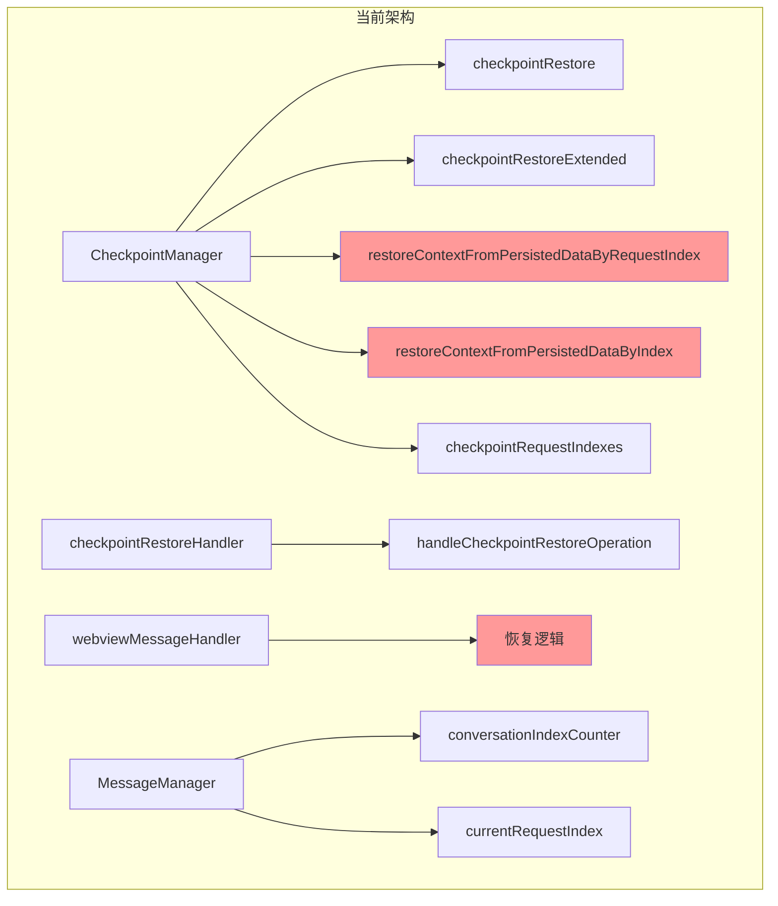
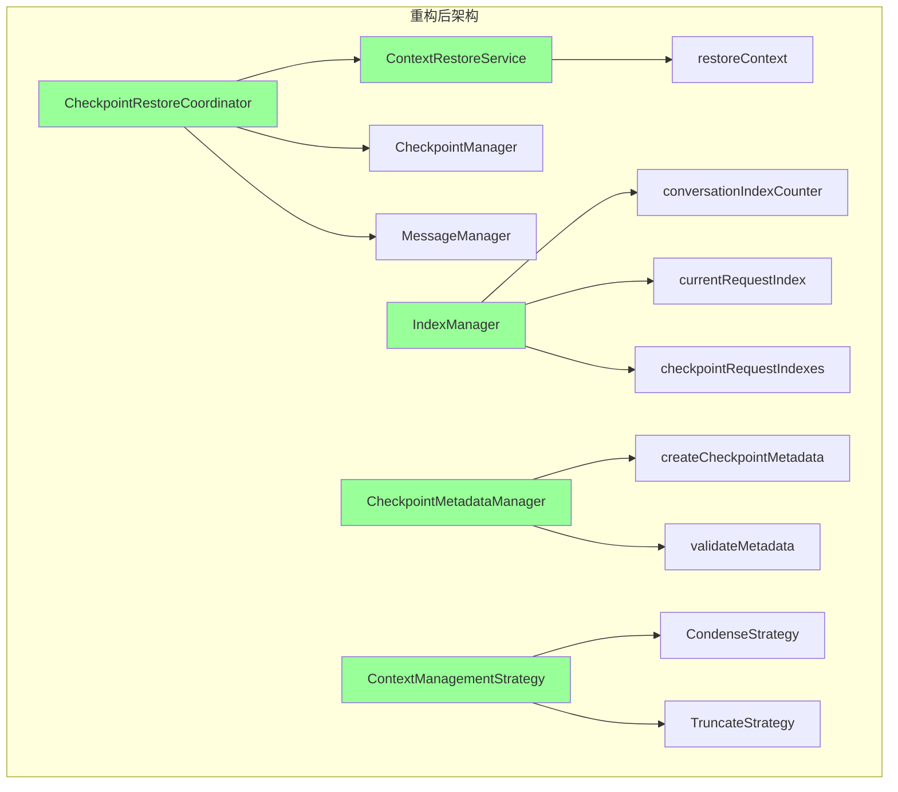
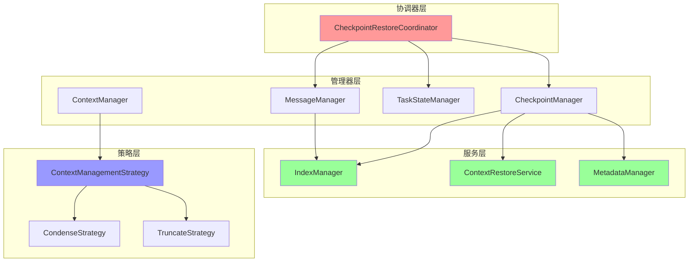

# 历史管理与检查点机制分析报告

## 执行摘要

本报告分析了 Roo-Code 项目中历史管理与检查点机制的实现，识别了上下文检查点的重复逻辑，并提出了可以提取为通用模块的建议，以及这些模块的组织结构建议。

## 一、核心模块概览

### 1.1 主要模块结构

```
src/core/
├── checkpoints/
│   ├── CheckpointDecisionEngine.ts    # 检查点决策引擎
│   └── types.ts                       # 检查点类型定义
├── context-management/
│   └── index.ts                       # 上下文管理（压缩+截断）
├── condense/
│   └── index.ts                       # 对话摘要压缩
├── task-persistence/
│   └── apiMessages.ts                 # API消息持久化
└── task/managers/
    ├── checkpoint/
    │   └── CheckpointManager.ts       # 检查点管理器
    ├── messaging/
    │   ├── MessageManager.ts          # 消息管理器
    │   └── ConversationHistoryManager.ts  # 对话历史管理器
    └── context/
        └── ContextManager.ts          # 上下文管理器
```

### 1.2 关键数据流



## 二、发现的重复逻辑

### 2.1 上下文恢复方法重复 ⚠️ 高优先级

**位置**: `src/core/task/managers/checkpoint/CheckpointManager.ts`

**问题**: 存在两个几乎完全相同的上下文恢复方法：

#### 方法1: `restoreContextFromPersistedDataByRequestIndex` (行211-260)
```typescript
async restoreContextFromPersistedDataByRequestIndex(targetRequestIndex: number): Promise<boolean>
```

#### 方法2: `restoreContextFromPersistedDataByIndex` (行266-311)
```typescript
async restoreContextFromPersistedDataByIndex(targetConversationIndex: number): Promise<boolean>
```

**重复度**: 95%+

**差异**:
- 参数名称不同（`targetRequestIndex` vs `targetConversationIndex`）
- 日志消息略有不同
- 核心逻辑完全相同

**共同逻辑**:
1. 获取持久化的API对话历史
2. 找到目标索引的恢复点（查找最后一条不超过目标索引的助手消息）
3. 截取到恢复点的历史记录
4. 恢复到内存中
5. 从对话历史中推断并恢复任务状态
6. 设置当前请求索引

**建议**: 合并为一个通用方法，使用参数区分不同的索引类型。

---

### 2.2 检查点恢复逻辑分散 ⚠️ 中优先级

**问题**: 检查点恢复逻辑分散在多个模块中：

#### 2.2.1 CheckpointManager 中的恢复方法

| 方法 | 位置 | 功能 |
|------|------|------|
| `checkpointRestore` | 行133-147 | 标准检查点恢复（文件系统） |
| `checkpointRestoreExtended` | 行379-421 | 扩展恢复（支持API上下文） |
| `restoreContextFromPersistedDataByRequestIndex` | 行211-260 | 基于请求索引恢复上下文 |
| `restoreContextFromPersistedDataByIndex` | 行266-311 | 基于对话索引恢复上下文 |

#### 2.2.2 Webview 层的恢复逻辑

**位置**: `src/core/webview/checkpointRestoreHandler.ts`

```typescript
export async function handleCheckpointRestoreOperation(config: CheckpointRestoreConfig)
```

**职责**:
- 处理删除和编辑操作的检查点恢复
- 管理待处理的编辑操作
- 协调任务中止和重新初始化

#### 2.2.3 WebviewMessageHandler 中的恢复逻辑

**位置**: `src/core/webview/webviewMessageHandler.ts` (行757-795)

```typescript
// 根据恢复类型决定是否取消任务
if (restoreType === "files_and_context" || !restoreType) {
    await provider.cancelTask()
    // ... 等待初始化
}

// 使用扩展的检查点恢复方法
if (restoreType === "context_only" && apiRequestId) {
    // 仅恢复上下文
} else {
    // 恢复文件和上下文
}
```

**问题**: 恢复逻辑在多个地方重复，缺乏统一的恢复策略。

---

### 2.3 上下文管理逻辑重复 ⚠️ 中优先级

#### 2.3.1 上下文窗口超限处理

**位置**: `src/core/task/managers/context/ContextManager.ts` (行84-219)

```typescript
async handleContextWindowExceededError(options: HandleContextWindowExceededOptions)
```

**职责**:
- 检测上下文窗口超限
- 调用上下文管理（压缩或截断）
- 发送UI通知

#### 2.3.2 上下文管理核心逻辑

**位置**: `src/core/context-management/index.ts` (行240-361)

```typescript
export async function manageContext(options: ContextManagementOptions): Promise<ContextManagementResult>
```

**职责**:
- 智能压缩对话历史
- 回退到滑动窗口截断
- 计算token使用

#### 2.3.3 对话摘要压缩

**位置**: `src/core/condense/index.ts` (行146-326)

```typescript
export async function summarizeConversation(...): Promise<SummarizeResponse>
```

**职责**:
- 使用LLM生成对话摘要
- 非破坏性压缩（标记而非删除）
- 保留最后N条消息

**问题**: 上下文管理逻辑分散在三个模块中，职责边界不够清晰。

---

### 2.4 索引管理重复 ⚠️ 低优先级

#### 2.4.1 MessageManager 中的索引管理

**位置**: `src/core/task/managers/messaging/MessageManager.ts`

```typescript
private conversationIndexCounter: number = 0
private currentRequestIndex: number | undefined

startNewApiRequest(): number
getCurrentRequestIndex(): number | undefined
setCurrentRequestIndex(index: number): void
```

#### 2.4.2 CheckpointManager 中的索引映射

**位置**: `src/core/task/managers/checkpoint/CheckpointManager.ts`

```typescript
private checkpointRequestIndexes: Map<string, number> = new Map()

setCheckpointRequestIndex(commitHash: string, requestIndex: number): Promise<void>
getCheckpointRequestIndex(commitHash: string): number | undefined
```

**问题**: 两个模块都管理索引，但缺乏统一的索引管理策略。

---

### 2.5 检查点元数据分散 ⚠️ 低优先级

#### 2.5.1 ApiMessage 中的检查点元数据

**位置**: `src/core/task-persistence/apiMessages.ts` (行38-45)

```typescript
checkpointMetadata?: {
    isCheckpoint: boolean
    requestIndex?: number
    checkpointHash?: string
    systemPrompt?: string
    toolProtocol?: string
    contextTokens?: number
}
```

#### 2.5.2 CheckpointRestoreOptionsExtended

**位置**: `src/core/checkpoints/types.ts` (行26-35)

```typescript
export interface CheckpointRestoreOptionsExtended {
    ts: number
    commitHash: string
    mode: "preview" | "restore"
    operation?: "delete" | "edit"
    restoreApiContext?: boolean
    restoreType?: RestoreType
    conversationIndex?: number
}
```

**问题**: 检查点元数据定义分散，缺乏统一的元数据模型。

---

## 三、建议提取的通用模块

### 3.1 上下文恢复服务 ⭐ 高优先级

**目标**: 统一上下文恢复逻辑，消除重复代码

**建议模块**: `src/core/context-management/ContextRestoreService.ts`

```typescript
export interface ContextRestoreOptions {
    targetIndex: number
    indexType: 'request' | 'conversation'
    messageManager: MessageManager
    stateManager: TaskStateManager
}

export class ContextRestoreService {
    /**
     * 统一的上下文恢复方法
     */
    async restoreContext(options: ContextRestoreOptions): Promise<boolean> {
        // 1. 获取持久化的API对话历史
        // 2. 根据索引类型找到恢复点
        // 3. 截取历史记录
        // 4. 恢复到内存
        // 5. 恢复任务状态
        // 6. 设置当前索引
    }

    /**
     * 从对话历史恢复任务状态
     */
    private async restoreTaskStateFromHistory(history: ApiMessage[]): Promise<void> {
        // 查找检查点消息
        // 恢复工具协议
        // 恢复系统提示词
    }
}
```

**收益**:
- 消除 `restoreContextFromPersistedDataByRequestIndex` 和 `restoreContextFromPersistedDataByIndex` 的重复
- 统一恢复逻辑，便于维护
- 支持未来扩展新的索引类型

---

### 3.2 检查点恢复协调器 ⭐ 高优先级

**目标**: 统一检查点恢复流程，协调各个恢复步骤

**建议模块**: `src/core/checkpoints/CheckpointRestoreCoordinator.ts`

```typescript
export interface CheckpointRestoreConfig {
    ts: number
    commitHash: string
    mode: "preview" | "restore"
    operation: "delete" | "edit"
    restoreType: RestoreType
    provider: ClineProvider
    task: Task
    editData?: EditData
}

export class CheckpointRestoreCoordinator {
    /**
     * 协调完整的检查点恢复流程
     */
    async coordinateRestore(config: CheckpointRestoreConfig): Promise<void> {
        // 1. 验证恢复配置
        // 2. 准备恢复环境（中止任务、设置待处理操作）
        // 3. 执行文件系统恢复
        // 4. 执行上下文恢复（如果需要）
        // 5. 保存消息
        // 6. 重新初始化任务
    }

    /**
     * 准备恢复环境
     */
    private async prepareRestoreEnvironment(config: CheckpointRestoreConfig): Promise<void> {
        // 处理任务中止
        // 设置待处理编辑操作
    }

    /**
     * 执行文件系统恢复
     */
    private async restoreFileSystem(config: CheckpointRestoreConfig): Promise<void> {
        // 调用 checkpointRestore
    }

    /**
     * 执行上下文恢复
     */
    private async restoreContext(config: CheckpointRestoreConfig): Promise<void> {
        // 调用 checkpointRestoreExtended
    }

    /**
     * 完成恢复流程
     */
    private async completeRestore(config: CheckpointRestoreConfig): Promise<void> {
        // 保存消息
        // 重新初始化任务
    }
}
```

**收益**:
- 统一恢复流程，消除分散的恢复逻辑
- 清晰的恢复步骤，便于调试和维护
- 支持扩展新的恢复类型

---

### 3.3 索引管理器 ⭐ 中优先级

**目标**: 统一索引管理，提供一致的索引策略

**建议模块**: `src/core/context-management/IndexManager.ts`

```typescript
export interface IndexManagerOptions {
    taskId: string
    globalStoragePath: string
}

export class IndexManager {
    private conversationIndexCounter: number = 0
    private currentRequestIndex: number | undefined
    private checkpointRequestIndexes: Map<string, number> = new Map()

    /**
     * 开始新的API请求，分配请求索引
     */
    startNewApiRequest(): number {
        const requestIndex = this.conversationIndexCounter++
        this.currentRequestIndex = requestIndex
        return requestIndex
    }

    /**
     * 获取当前请求索引
     */
    getCurrentRequestIndex(): number | undefined {
        return this.currentRequestIndex
    }

    /**
     * 设置当前请求索引
     */
    setCurrentRequestIndex(index: number): void {
        this.currentRequestIndex = index
    }

    /**
     * 关联检查点和请求索引
     */
    async associateCheckpointWithRequest(commitHash: string, requestIndex: number): Promise<void> {
        this.checkpointRequestIndexes.set(commitHash, requestIndex)
        await this.persistCheckpointIndexes()
    }

    /**
     * 获取检查点关联的请求索引
     */
    getCheckpointRequestIndex(commitHash: string): number | undefined {
        return this.checkpointRequestIndexes.get(commitHash)
    }

    /**
     * 从持久化存储加载索引
     */
    async loadIndexes(): Promise<void> {
        // 加载 conversationIndexCounter
        // 加载 checkpointRequestIndexes
    }

    /**
     * 持久化索引
     */
    private async persistCheckpointIndexes(): Promise<void> {
        // 保存 checkpointRequestIndexes
    }
}
```

**收益**:
- 统一索引管理，消除分散的索引逻辑
- 提供一致的索引策略
- 便于扩展新的索引类型

---

### 3.4 检查点元数据管理器 ⭐ 低优先级

**目标**: 统一检查点元数据管理

**建议模块**: `src/core/checkpoints/CheckpointMetadataManager.ts`

```typescript
export interface CheckpointMetadata {
    isCheckpoint: boolean
    requestIndex?: number
    checkpointHash?: string
    systemPrompt?: string
    toolProtocol?: string
    contextTokens?: number
    timestamp: number
    taskId: string
}

export class CheckpointMetadataManager {
    /**
     * 创建检查点元数据
     */
    createCheckpointMetadata(options: Partial<CheckpointMetadata>): CheckpointMetadata {
        return {
            isCheckpoint: true,
            timestamp: Date.now(),
            ...options
        }
    }

    /**
     * 验证检查点元数据
     */
    validateMetadata(metadata: CheckpointMetadata): boolean {
        // 验证必需字段
        // 验证数据类型
    }

    /**
     * 序列化元数据
     */
    serialize(metadata: CheckpointMetadata): string {
        return JSON.stringify(metadata)
    }

    /**
     * 反序列化元数据
     */
    deserialize(data: string): CheckpointMetadata {
        return JSON.parse(data)
    }
}
```

**收益**:
- 统一元数据管理
- 提供元数据验证
- 便于扩展新的元数据字段

---

### 3.5 上下文管理策略接口 ⭐ 中优先级

**目标**: 定义清晰的上下文管理策略接口

**建议模块**: `src/core/context-management/ContextManagementStrategy.ts`

```typescript
export interface ContextManagementStrategy {
    /**
     * 检查是否需要管理上下文
     */
    shouldManageContext(options: ContextCheckOptions): boolean

    /**
     * 执行上下文管理
     */
    manageContext(options: ContextManageOptions): Promise<ContextManagementResult>
}

export interface ContextCheckOptions {
    totalTokens: number
    contextWindow: number
    maxTokens?: number
    autoCondenseContext: boolean
    autoCondenseContextPercent: number
    profileThresholds: Record<string, number>
    currentProfileId: string
    lastMessageTokens: number
}

export interface ContextManageOptions extends ContextCheckOptions {
    messages: ApiMessage[]
    apiHandler: ApiHandler
    systemPrompt: string
    taskId: string
    customCondensingPrompt?: string
    condensingApiHandler?: ApiHandler
    useNativeTools?: boolean
}

/**
 * 智能压缩策略
 */
export class CondenseStrategy implements ContextManagementStrategy {
    shouldManageContext(options: ContextCheckOptions): boolean {
        // 检查是否达到压缩阈值
    }

    async manageContext(options: ContextManageOptions): Promise<ContextManagementResult> {
        // 执行对话摘要压缩
    }
}

/**
 * 滑动窗口截断策略
 */
export class TruncateStrategy implements ContextManagementStrategy {
    shouldManageContext(options: ContextCheckOptions): boolean {
        // 检查是否需要截断
    }

    async manageContext(options: ContextManageOptions): Promise<ContextManagementResult> {
        // 执行滑动窗口截断
    }
}
```

**收益**:
- 清晰的策略接口
- 支持策略组合
- 便于扩展新的管理策略

---

## 四、重构建议

### 4.1 短期重构（1-2周）

#### 优先级1: 合并重复的上下文恢复方法

**步骤**:
1. 创建 `ContextRestoreService.ts`
2. 实现统一的 `restoreContext` 方法
3. 更新 `CheckpointManager` 使用新服务
4. 删除旧的重复方法
5. 添加单元测试

**影响范围**:
- `CheckpointManager.ts`
- 新增 `ContextRestoreService.ts`

**风险**: 低

---

#### 优先级2: 创建检查点恢复协调器

**步骤**:
1. 创建 `CheckpointRestoreCoordinator.ts`
2. 实现协调逻辑
3. 更新 `checkpointRestoreHandler.ts` 使用协调器
4. 更新 `webviewMessageHandler.ts` 使用协调器
5. 添加集成测试

**影响范围**:
- `checkpointRestoreHandler.ts`
- `webviewMessageHandler.ts`
- 新增 `CheckpointRestoreCoordinator.ts`

**风险**: 中

---

### 4.2 中期重构（2-4周）

#### 优先级3: 统一索引管理

**步骤**:
1. 创建 `IndexManager.ts`
2. 迁移 `MessageManager` 的索引逻辑
3. 迁移 `CheckpointManager` 的索引映射逻辑
4. 更新依赖模块使用 `IndexManager`
5. 添加单元测试

**影响范围**:
- `MessageManager.ts`
- `CheckpointManager.ts`
- 新增 `IndexManager.ts`

**风险**: 中

---

#### 优先级4: 实现上下文管理策略接口

**步骤**:
1. 创建 `ContextManagementStrategy.ts`
2. 实现策略类
3. 重构 `ContextManager` 使用策略
4. 重构 `context-management/index.ts` 使用策略
5. 添加单元测试

**影响范围**:
- `ContextManager.ts`
- `context-management/index.ts`
- 新增 `ContextManagementStrategy.ts`

**风险**: 中

---

### 4.3 长期重构（1-2个月）

#### 优先级5: 统一检查点元数据管理

**步骤**:
1. 创建 `CheckpointMetadataManager.ts`
2. 定义统一的元数据模型
3. 更新所有使用元数据的地方
4. 添加元数据验证
5. 添加单元测试

**影响范围**:
- `apiMessages.ts`
- `checkpoints/types.ts`
- `CheckpointManager.ts`
- 新增 `CheckpointMetadataManager.ts`

**风险**: 低

---

## 五、架构图

### 5.1 当前架构



### 5.2 重构后架构



---

## 六、测试策略

### 6.1 单元测试

#### ContextRestoreService
- 测试基于请求索引的恢复
- 测试基于对话索引的恢复
- 测试恢复失败场景
- 测试任务状态恢复

#### CheckpointRestoreCoordinator
- 测试删除操作的恢复流程
- 测试编辑操作的恢复流程
- 测试仅恢复上下文
- 测试恢复文件和上下文

#### IndexManager
- 测试索引分配
- 测试索引关联
- 测试索引持久化
- 测试索引恢复

### 6.2 集成测试

- 测试完整的检查点恢复流程
- 测试上下文恢复与文件恢复的协调
- 测试不同恢复类型的场景

### 6.3 回归测试

- 确保重构后所有现有功能正常工作
- 测试边界情况和错误处理

---

## 七、风险评估

### 7.1 技术风险

| 风险 | 影响 | 概率 | 缓解措施 |
|------|------|------|----------|
| 重构引入新bug | 高 | 中 | 完善的测试覆盖，分阶段重构 |
| 性能下降 | 中 | 低 | 性能测试，优化关键路径 |
| 兼容性问题 | 中 | 低 | 保持向后兼容，渐进式迁移 |

### 7.2 业务风险

| 风险 | 影响 | 概率 | 缓解措施 |
|------|------|------|----------|
| 功能缺失 | 高 | 低 | 详细的功能对比测试 |
| 用户体验下降 | 中 | 低 | 用户测试，收集反馈 |

---

## 八、模块组织结构建议

### 8.1 当前目录结构分析

#### 8.1.1 现有核心管理器目录

```
src/core/task/managers/
├── core/                          # 核心任务管理器
│   ├── SubtaskManager.ts          # 子任务管理
│   ├── TaskLifecycleManager.ts    # 任务生命周期管理
│   └── TaskStateManager.ts        # 任务状态管理
├── checkpoint/                    # 检查点管理
│   └── CheckpointManager.ts
├── messaging/                     # 消息管理
│   ├── MessageManager.ts
│   ├── ConversationHistoryManager.ts
│   ├── ConversationRewindManager.ts
│   └── MessageQueueManager.ts
├── context/                       # 上下文管理
│   ├── ContextManager.ts
│   └── PromptManager.ts
└── api/                           # API管理
    ├── ApiRequestManager.ts
    └── StreamingManager.ts
```

**核心管理器特点**:
- `TaskStateManager`: 管理任务的基本状态（模式、协议、中止标志等）
- `TaskLifecycleManager`: 管理任务的生命周期（启动、恢复、中止、销毁）
- `SubtaskManager`: 管理子任务的委托和恢复

这些管理器都是**任务级别的核心功能**，不依赖于特定的业务逻辑。

---

### 8.2 建议的模块组织结构

#### 8.2.1 通用模块分类原则

根据模块的职责和复用性，将通用模块分为以下几类：

| 类别 | 定义 | 示例 |
|------|------|------|
| **核心通用模块** | 跨多个管理器使用的底层服务 | IndexManager, ContextRestoreService |
| **业务协调模块** | 协调多个管理器的业务流程 | CheckpointRestoreCoordinator |
| **策略接口模块** | 定义可扩展的策略接口 | ContextManagementStrategy |
| **元数据管理模块** | 统一管理元数据 | CheckpointMetadataManager |

#### 8.2.2 推荐的目录结构

```
src/core/task/managers/
├── core/                          # 核心任务管理器（现有）
│   ├── SubtaskManager.ts
│   ├── TaskLifecycleManager.ts
│   └── TaskStateManager.ts
│
├── services/                      # 【新增】通用服务层
│   ├── IndexManager.ts            # 索引管理服务
│   ├── ContextRestoreService.ts   # 上下文恢复服务
│   └── MetadataManager.ts         # 元数据管理服务
│
├── coordinators/                  # 【新增】协调器层
│   └── CheckpointRestoreCoordinator.ts  # 检查点恢复协调器
│
├── strategies/                    # 【新增】策略层
│   ├── ContextManagementStrategy.ts    # 上下文管理策略接口
│   ├── CondenseStrategy.ts             # 压缩策略
│   └── TruncateStrategy.ts             # 截断策略
│
├── checkpoint/                    # 检查点管理（现有）
│   └── CheckpointManager.ts
│
├── messaging/                     # 消息管理（现有）
│   ├── MessageManager.ts
│   ├── ConversationHistoryManager.ts
│   ├── ConversationRewindManager.ts
│   └── MessageQueueManager.ts
│
├── context/                       # 上下文管理（现有）
│   ├── ContextManager.ts
│   └── PromptManager.ts
│
└── api/                           # API管理（现有）
    ├── ApiRequestManager.ts
    └── StreamingManager.ts
```

---

### 8.3 各模块的详细组织说明

#### 8.3.1 services/ - 通用服务层

**职责**: 提供跨多个管理器使用的底层服务，这些服务通常是**无状态的**或**轻量级**的。

**放置原则**:
- 如果一个模块被多个管理器使用
- 如果一个模块不依赖于特定的业务流程
- 如果一个模块提供的是工具性功能

**建议放置的模块**:

| 模块 | 放置位置 | 理由 |
|------|----------|------|
| `IndexManager` | `services/IndexManager.ts` | 被 MessageManager 和 CheckpointManager 共同使用，提供索引分配和映射功能 |
| `ContextRestoreService` | `services/ContextRestoreService.ts` | 提供统一的上下文恢复逻辑，可被多个恢复流程使用 |
| `CheckpointMetadataManager` | `services/MetadataManager.ts` | 提供元数据的创建、验证和序列化功能 |

**示例代码结构**:

```typescript
// src/core/task/managers/services/IndexManager.ts
export interface IndexManagerOptions {
    taskId: string
    globalStoragePath: string
}

export class IndexManager {
    // 索引管理逻辑
}
```

---

#### 8.3.2 coordinators/ - 协调器层

**职责**: 协调多个管理器完成复杂的业务流程，这些协调器通常是**有状态的**或**流程导向**的。

**放置原则**:
- 如果一个模块需要协调多个管理器
- 如果一个模块封装了复杂的业务流程
- 如果一个模块有明确的开始和结束步骤

**建议放置的模块**:

| 模块 | 放置位置 | 理由 |
|------|----------|------|
| `CheckpointRestoreCoordinator` | `coordinators/CheckpointRestoreCoordinator.ts` | 协调 CheckpointManager、MessageManager、TaskStateManager 完成恢复流程 |

**示例代码结构**:

```typescript
// src/core/task/managers/coordinators/CheckpointRestoreCoordinator.ts
export interface CheckpointRestoreConfig {
    ts: number
    commitHash: string
    mode: "preview" | "restore"
    operation: "delete" | "edit"
    restoreType: RestoreType
    provider: ClineProvider
    task: Task
    editData?: EditData
}

export class CheckpointRestoreCoordinator {
    private checkpointManager: CheckpointManager
    private messageManager: MessageManager
    private stateManager: TaskStateManager
    
    constructor(config: CheckpointRestoreConfig) {
        // 初始化依赖的管理器
    }
    
    async coordinateRestore(): Promise<void> {
        // 协调恢复流程
    }
}
```

---

#### 8.3.3 strategies/ - 策略层

**职责**: 定义可扩展的策略接口和实现，支持策略模式的业务逻辑。

**放置原则**:
- 如果一个模块定义了可替换的行为
- 如果一个模块需要支持多种实现方式
- 如果一个模块遵循策略模式

**建议放置的模块**:

| 模块 | 放置位置 | 理由 |
|------|----------|------|
| `ContextManagementStrategy` | `strategies/ContextManagementStrategy.ts` | 定义上下文管理的策略接口 |
| `CondenseStrategy` | `strategies/CondenseStrategy.ts` | 实现压缩策略 |
| `TruncateStrategy` | `strategies/TruncateStrategy.ts` | 实现截断策略 |

**示例代码结构**:

```typescript
// src/core/task/managers/strategies/ContextManagementStrategy.ts
export interface ContextManagementStrategy {
    shouldManageContext(options: ContextCheckOptions): boolean
    manageContext(options: ContextManageOptions): Promise<ContextManagementResult>
}

export class CondenseStrategy implements ContextManagementStrategy {
    // 压缩策略实现
}

export class TruncateStrategy implements ContextManagementStrategy {
    // 截断策略实现
}
```

---

### 8.4 模块依赖关系图



---

### 8.5 模块迁移路径

#### 8.5.1 第一阶段：创建服务层（1-2周）

**目标**: 创建 `services/` 目录，迁移通用服务

**步骤**:
1. 创建 `src/core/task/managers/services/` 目录
2. 创建 `IndexManager.ts`
3. 创建 `ContextRestoreService.ts`
4. 创建 `MetadataManager.ts`
5. 更新 `CheckpointManager` 使用新服务
6. 更新 `MessageManager` 使用新服务
7. 添加单元测试

**影响范围**:
- 新增 `services/` 目录
- 修改 `CheckpointManager.ts`
- 修改 `MessageManager.ts`

---

#### 8.5.2 第二阶段：创建协调器层（2-3周）

**目标**: 创建 `coordinators/` 目录，迁移协调逻辑

**步骤**:
1. 创建 `src/core/task/managers/coordinators/` 目录
2. 创建 `CheckpointRestoreCoordinator.ts`
3. 更新 `checkpointRestoreHandler.ts` 使用协调器
4. 更新 `webviewMessageHandler.ts` 使用协调器
5. 添加集成测试

**影响范围**:
- 新增 `coordinators/` 目录
- 修改 `checkpointRestoreHandler.ts`
- 修改 `webviewMessageHandler.ts`

---

#### 8.5.3 第三阶段：创建策略层（3-4周）

**目标**: 创建 `strategies/` 目录，实现策略模式

**步骤**:
1. 创建 `src/core/task/managers/strategies/` 目录
2. 创建 `ContextManagementStrategy.ts`
3. 创建 `CondenseStrategy.ts`
4. 创建 `TruncateStrategy.ts`
5. 重构 `ContextManager` 使用策略
6. 重构 `context-management/index.ts` 使用策略
7. 添加单元测试

**影响范围**:
- 新增 `strategies/` 目录
- 修改 `ContextManager.ts`
- 修改 `context-management/index.ts`

---

### 8.6 命名规范

#### 8.6.1 服务层命名

- 文件名: `{功能}Manager.ts` 或 `{功能}Service.ts`
- 类名: `{功能}Manager` 或 `{功能}Service`
- 示例: `IndexManager`, `ContextRestoreService`

#### 8.6.2 协调器层命名

- 文件名: `{业务}Coordinator.ts`
- 类名: `{业务}Coordinator`
- 示例: `CheckpointRestoreCoordinator`

#### 8.6.3 策略层命名

- 文件名: `{功能}Strategy.ts` 或 `{具体实现}Strategy.ts`
- 类名: `{功能}Strategy` 或 `{具体实现}Strategy`
- 示例: `ContextManagementStrategy`, `CondenseStrategy`

---

### 8.7 导出和导入规范

#### 8.7.1 服务层导出

```typescript
// src/core/task/managers/services/index.ts
export { IndexManager } from './IndexManager'
export { ContextRestoreService } from './ContextRestoreService'
export { MetadataManager } from './MetadataManager'
```

#### 8.7.2 协调器层导出

```typescript
// src/core/task/managers/coordinators/index.ts
export { CheckpointRestoreCoordinator } from './CheckpointRestoreCoordinator'
```

#### 8.7.3 策略层导出

```typescript
// src/core/task/managers/strategies/index.ts
export { ContextManagementStrategy } from './ContextManagementStrategy'
export { CondenseStrategy } from './CondenseStrategy'
export { TruncateStrategy } from './TruncateStrategy'
```

#### 8.7.4 统一导出

```typescript
// src/core/task/managers/index.ts
export * from './core'
export * from './services'
export * from './coordinators'
export * from './strategies'
export * from './checkpoint'
export * from './messaging'
export * from './context'
export * from './api'
```

---

### 8.8 与现有架构的兼容性

#### 8.8.1 向后兼容

- 保持现有管理器的公共接口不变
- 新服务通过依赖注入的方式引入
- 逐步迁移，避免大规模重构

#### 8.8.2 渐进式迁移

1. **第一阶段**: 创建新服务，但不强制使用
2. **第二阶段**: 逐步迁移现有代码使用新服务
3. **第三阶段**: 移除旧的重复代码

#### 8.8.3 测试策略

- 为每个新服务添加单元测试
- 为协调器添加集成测试
- 确保重构后所有现有测试通过

---

## 九、总结

### 9.1 主要发现

1. **高优先级问题**:
   - `restoreContextFromPersistedDataByRequestIndex` 和 `restoreContextFromPersistedDataByIndex` 95%重复
   - 检查点恢复逻辑分散在多个模块中

2. **中优先级问题**:
   - 上下文管理逻辑分散在三个模块中
   - 索引管理缺乏统一策略

3. **低优先级问题**:
   - 检查点元数据定义分散

### 9.2 建议行动

1. **立即行动**（1-2周）:
   - 合并重复的上下文恢复方法
   - 创建检查点恢复协调器

2. **短期行动**（2-4周）:
   - 统一索引管理
   - 实现上下文管理策略接口

3. **长期行动**（1-2个月）:
   - 统一检查点元数据管理

### 9.3 预期收益

- **代码质量**: 消除重复代码，提高可维护性
- **架构清晰**: 统一职责边界，降低耦合度
- **扩展性**: 便于添加新功能和策略
- **测试性**: 模块化设计，便于单元测试
- **组织性**: 清晰的目录结构，便于团队协作

---

## 附录

### A. 相关文件清单

| 文件路径 | 行数 | 职责 |
|---------|------|------|
| `src/core/task/managers/checkpoint/CheckpointManager.ts` | 422 | 检查点管理 |
| `src/core/task/managers/context/ContextManager.ts` | 228 | 上下文管理 |
| `src/core/task/managers/messaging/MessageManager.ts` | 312 | 消息管理 |
| `src/core/context-management/index.ts` | 361 | 上下文管理核心 |
| `src/core/condense/index.ts` | 465 | 对话摘要 |
| `src/core/webview/checkpointRestoreHandler.ts` | 141 | 检查点恢复处理 |
| `src/core/checkpoints/types.ts` | 121 | 类型定义 |

### B. 术语表

| 术语 | 定义 |
|------|------|
| 检查点 | 文件系统状态的快照 |
| 上下文快照 | API对话历史的状态 |
| 请求索引 | 标识API请求的唯一索引 |
| 对话索引 | 标识对话轮次的索引 |
| 非破坏性压缩 | 标记消息而非删除的压缩方式 |
| 滑动窗口截断 | 保留最近消息的截断方式 |

---

**报告生成时间**: 2025-01-XX  
**分析人员**: Architect Mode  
**版本**: 1.0