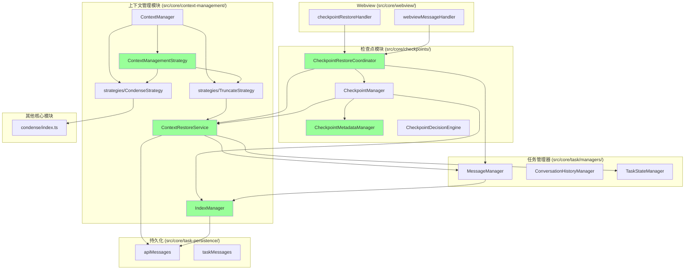

# 检查点与上下文管理模块组织方案

## 目录组织原则

### 核心原则

1. **功能内聚** - 相关功能放在同一目录下
2. **职责清晰** - 每个模块有明确的单一职责
3. **层次分明** - 核心服务、任务管理器、Webview交互分层组织
4. **易于扩展** - 便于添加新功能和策略

---

## 当前目录结构

```
src/core/
├── checkpoints/              # 检查点核心功能
│   ├── CheckpointDecisionEngine.ts
│   ├── index.ts
│   └── types.ts
├── context-management/       # 上下文管理核心
│   └── index.ts
├── condense/                 # 对话压缩
│   └── index.ts
├── task-persistence/         # 任务持久化
│   ├── apiMessages.ts
│   ├── index.ts
│   ├── taskMessages.ts
│   └── taskMetadata.ts
├── task/                     # 任务管理
│   └── managers/
│       ├── checkpoint/
│       │   └── CheckpointManager.ts
│       ├── messaging/
│       │   ├── MessageManager.ts
│       │   └── ConversationHistoryManager.ts
│       └── context/
│           └── ContextManager.ts
└── webview/                  # Webview交互
    ├── checkpointRestoreHandler.ts
    └── webviewMessageHandler.ts
```

---

## 建议的目录组织

### 完整目录结构

```
src/core/
├── checkpoints/                          # 检查点核心功能
│   ├── CheckpointDecisionEngine.ts      # 检查点决策引擎（已存在）
│   ├── CheckpointRestoreCoordinator.ts  # 检查点恢复协调器（新增）
│   ├── CheckpointMetadataManager.ts     # 检查点元数据管理器（新增）
│   ├── index.ts                         # 导出入口（已存在）
│   └── types.ts                         # 类型定义（已存在）
│
├── context-management/                  # 上下文管理核心
│   ├── ContextRestoreService.ts         # 上下文恢复服务（新增）
│   ├── IndexManager.ts                  # 索引管理器（新增）
│   ├── ContextManagementStrategy.ts     # 上下文管理策略接口（新增）
│   ├── strategies/                      # 策略实现（新增子目录）
│   │   ├── CondenseStrategy.ts          # 压缩策略（新增）
│   │   └── TruncateStrategy.ts          # 截断策略（新增）
│   └── index.ts                         # 导出入口（已存在）
│
├── condense/                            # 对话压缩（保持不变）
│   └── index.ts
│
├── task-persistence/                    # 任务持久化（保持不变）
│   ├── apiMessages.ts
│   ├── index.ts
│   ├── taskMessages.ts
│   └── taskMetadata.ts
│
├── task/                                # 任务管理
│   └── managers/
│       ├── checkpoint/
│       │   └── CheckpointManager.ts     # 任务特定的检查点管理器
│       ├── messaging/
│       │   ├── MessageManager.ts        # 消息管理器
│       │   └── ConversationHistoryManager.ts  # 对话历史管理器
│       └── context/
│           └── ContextManager.ts        # 任务特定的上下文管理器
│
└── webview/                             # Webview交互（保持不变）
    ├── checkpointRestoreHandler.ts
    └── webviewMessageHandler.ts
```

---

## 模块组织详细说明

### 1. ContextRestoreService

**位置**: `src/core/context-management/ContextRestoreService.ts`

**组织理由**:
- ✅ 属于上下文管理的核心功能
- ✅ 不依赖于Task实例，是纯服务类
- ✅ 可以被多个模块复用
- ✅ 与现有的 `context-management/index.ts` 功能相关

**职责**:
- 统一的上下文恢复逻辑
- 从持久化数据恢复对话历史
- 恢复任务状态（工具协议、系统提示词等）

**依赖关系**:
```typescript
// 依赖
import { MessageManager } from '../task/managers/messaging/MessageManager'
import { TaskStateManager } from '../task/managers/core/TaskStateManager'
import { readApiMessages } from '../task-persistence'

// 被依赖
// - CheckpointManager
// - CheckpointRestoreCoordinator
```

**使用场景**:
```typescript
// 在 CheckpointManager 中使用
import { ContextRestoreService } from '../../context-management/ContextRestoreService'

class CheckpointManager {
    private contextRestoreService: ContextRestoreService
    
    async restoreContext(options: ContextRestoreOptions): Promise<boolean> {
        return this.contextRestoreService.restoreContext({
            targetIndex: options.targetIndex,
            indexType: options.indexType,
            messageManager: this.messageManager,
            stateManager: this.stateManager
        })
    }
}
```

---

### 2. CheckpointRestoreCoordinator

**位置**: `src/core/checkpoints/CheckpointRestoreCoordinator.ts`

**组织理由**:
- ✅ 属于检查点管理的核心功能
- ✅ 协调检查点恢复的完整流程
- ✅ 不依赖于特定的Task实例，是协调器模式
- ✅ 与现有的 `checkpoints/index.ts` 功能相关

**职责**:
- 协调文件系统恢复和上下文恢复
- 管理恢复流程的各个步骤
- 处理恢复前的准备工作（任务中止、待处理操作）
- 完成恢复后的清理工作

**依赖关系**:
```typescript
// 依赖
import { CheckpointManager } from '../task/managers/checkpoint/CheckpointManager'
import { ContextRestoreService } from '../context-management/ContextRestoreService'
import { MessageManager } from '../task/managers/messaging/MessageManager'
import { TaskStateManager } from '../task/managers/core/TaskStateManager'

// 被依赖
// - checkpointRestoreHandler
// - webviewMessageHandler
```

**使用场景**:
```typescript
// 在 checkpointRestoreHandler 中使用
import { CheckpointRestoreCoordinator } from '../../checkpoints/CheckpointRestoreCoordinator'

export async function handleCheckpointRestoreOperation(config: CheckpointRestoreConfig) {
    const coordinator = new CheckpointRestoreCoordinator()
    await coordinator.coordinateRestore(config)
}
```

---

### 3. IndexManager

**位置**: `src/core/context-management/IndexManager.ts`

**组织理由**:
- ✅ 属于上下文管理的核心功能
- ✅ 管理对话索引和请求索引
- ✅ 不依赖于Task实例，是纯管理器
- ✅ 索引管理是上下文管理的基础功能

**职责**:
- 分配和管理对话索引（conversationIndex）
- 分配和管理请求索引（requestIndex）
- 关联检查点和索引（checkpointRequestIndexes）
- 持久化索引数据
- 从持久化存储加载索引

**依赖关系**:
```typescript
// 依赖
import { GlobalFileNames } from '../../shared/globalFileNames'
import { getTaskDirectoryPath } from '../../utils/storage'
import { safeWriteJson } from '../../utils/safeWriteJson'

// 被依赖
// - MessageManager
// - CheckpointManager
```

**使用场景**:
```typescript
// 在 MessageManager 中使用
import { IndexManager } from '../../context-management/IndexManager'

class MessageManager {
    private indexManager: IndexManager
    
    startNewApiRequest(): number {
        return this.indexManager.startNewApiRequest()
    }
    
    getCurrentRequestIndex(): number | undefined {
        return this.indexManager.getCurrentRequestIndex()
    }
}

// 在 CheckpointManager 中使用
class CheckpointManager {
    private indexManager: IndexManager
    
    async createCheckpoint(requestIndex: number): Promise<void> {
        const result = await this.checkpointSave()
        if (result?.commit) {
            await this.indexManager.associateCheckpointWithRequest(result.commit, requestIndex)
        }
    }
}
```

---

### 4. ContextManagementStrategy

**位置**: `src/core/context-management/ContextManagementStrategy.ts`

**组织理由**:
- ✅ 定义上下文管理的策略接口
- ✅ 属于上下文管理的核心抽象
- ✅ 策略模式实现，便于扩展
- ✅ 与现有的 `context-management/index.ts` 功能相关

**子目录**: `src/core/context-management/strategies/`

**策略实现**:
- `CondenseStrategy.ts` - 智能压缩策略
- `TruncateStrategy.ts` - 滑动窗口截断策略

**职责**:
- 定义策略接口（`ContextManagementStrategy`）
- 提供策略基类
- 定义策略选项类型
- 实现具体的策略类

**依赖关系**:
```typescript
// ContextManagementStrategy.ts
import type { ApiMessage } from '../task-persistence'
import { ApiHandler } from '../../api'

// strategies/CondenseStrategy.ts
import { summarizeConversation } from '../../condense'

// strategies/TruncateStrategy.ts
import { truncateConversation } from '../index'

// 被依赖
// - ContextManager
```

**使用场景**:
```typescript
// 在 ContextManager 中使用
import { ContextManagementStrategy, CondenseStrategy, TruncateStrategy } from '../context-management/ContextManagementStrategy'

class ContextManager {
    private strategies: Map<string, ContextManagementStrategy>
    
    constructor() {
        this.strategies = new Map([
            ['condense', new CondenseStrategy()],
            ['truncate', new TruncateStrategy()]
        ])
    }
    
    async handleContextWindowExceededError(options: HandleContextWindowExceededOptions): Promise<void> {
        // 选择合适的策略
        const strategy = this.selectStrategy(options)
        const result = await strategy.manageContext(options)
        // 处理结果...
    }
}
```

---

### 5. CheckpointMetadataManager

**位置**: `src/core/checkpoints/CheckpointMetadataManager.ts`

**组织理由**:
- ✅ 属于检查点管理的核心功能
- ✅ 管理检查点元数据
- ✅ 不依赖于Task实例，是纯管理器
- ✅ 与现有的 `checkpoints/types.ts` 功能相关

**职责**:
- 创建检查点元数据
- 验证元数据完整性
- 序列化和反序列化元数据
- 提供元数据查询接口

**依赖关系**:
```typescript
// 依赖
import type { CheckpointMetadata } from './types'

// 被依赖
// - CheckpointManager
// - apiMessages.ts
```

**使用场景**:
```typescript
// 在 CheckpointManager 中使用
import { CheckpointMetadataManager } from './CheckpointMetadataManager'

class CheckpointManager {
    private metadataManager: CheckpointMetadataManager
    
    async createCheckpoint(requestIndex: number): Promise<void> {
        const metadata = this.metadataManager.createCheckpointMetadata({
            requestIndex,
            toolProtocol: this.stateManager.taskToolProtocol,
            contextTokens: this.getCurrentContextTokens()
        })
        
        // 将元数据附加到消息
        const messageWithMetadata = {
            ...message,
            checkpointMetadata: metadata
        }
    }
}
```

---

## 模块依赖关系图



---

## 迁移策略

### 阶段1: 创建新模块（不破坏现有代码）

#### 1.1 创建 ContextRestoreService

```bash
# 创建文件
touch src/core/context-management/ContextRestoreService.ts
touch src/core/context-management/__tests__/ContextRestoreService.spec.ts
```

**实现步骤**:
1. 实现 `ContextRestoreService` 类
2. 实现统一的 `restoreContext` 方法
3. 添加单元测试
4. 不修改现有代码

**向后兼容**:
- 新模块独立存在
- 不影响现有功能
- 可以逐步迁移

---

#### 1.2 创建 CheckpointRestoreCoordinator

```bash
# 创建文件
touch src/core/checkpoints/CheckpointRestoreCoordinator.ts
touch src/core/checkpoints/__tests__/CheckpointRestoreCoordinator.spec.ts
```

**实现步骤**:
1. 实现 `CheckpointRestoreCoordinator` 类
2. 实现协调逻辑
3. 添加集成测试
4. 不修改现有代码

---

#### 1.3 创建 IndexManager

```bash
# 创建文件
touch src/core/context-management/IndexManager.ts
touch src/core/context-management/__tests__/IndexManager.spec.ts
```

**实现步骤**:
1. 实现 `IndexManager` 类
2. 实现索引管理逻辑
3. 添加单元测试
4. 不修改现有代码

---

#### 1.4 创建 ContextManagementStrategy

```bash
# 创建文件和目录
mkdir -p src/core/context-management/strategies
touch src/core/context-management/ContextManagementStrategy.ts
touch src/core/context-management/strategies/CondenseStrategy.ts
touch src/core/context-management/strategies/TruncateStrategy.ts
touch src/core/context-management/__tests__/ContextManagementStrategy.spec.ts
```

**实现步骤**:
1. 定义策略接口
2. 实现策略类
3. 添加单元测试
4. 不修改现有代码

---

#### 1.5 创建 CheckpointMetadataManager

```bash
# 创建文件
touch src/core/checkpoints/CheckpointMetadataManager.ts
touch src/core/checkpoints/__tests__/CheckpointMetadataManager.spec.ts
```

**实现步骤**:
1. 实现 `CheckpointMetadataManager` 类
2. 实现元数据管理逻辑
3. 添加单元测试
4. 不修改现有代码

---

### 阶段2: 逐步迁移（渐进式替换）

#### 2.1 迁移 CheckpointManager

**步骤**:
1. 在 `CheckpointManager` 中引入新模块
2. 使用 `ContextRestoreService` 替换重复的恢复方法
3. 使用 `IndexManager` 管理索引
4. 使用 `CheckpointMetadataManager` 管理元数据
5. 保留向后兼容的API

**代码示例**:
```typescript
// CheckpointManager.ts
import { ContextRestoreService } from '../../context-management/ContextRestoreService'
import { IndexManager } from '../../context-management/IndexManager'
import { CheckpointMetadataManager } from '../CheckpointMetadataManager'

export class CheckpointManager {
    private contextRestoreService: ContextRestoreService
    private indexManager: IndexManager
    private metadataManager: CheckpointMetadataManager
    
    constructor(options: CheckpointManagerOptions) {
        // 初始化新模块
        this.contextRestoreService = new ContextRestoreService()
        this.indexManager = new IndexManager({
            taskId: options.taskId,
            globalStoragePath: options.globalStoragePath
        })
        this.metadataManager = new CheckpointMetadataManager()
    }
    
    // 新方法
    async restoreContext(options: ContextRestoreOptions): Promise<boolean> {
        return this.contextRestoreService.restoreContext({
            targetIndex: options.targetIndex,
            indexType: options.indexType,
            messageManager: this.messageManager,
            stateManager: this.stateManager
        })
    }
    
    // 旧方法（标记为deprecated）
    @deprecated('Use restoreContext instead')
    async restoreContextFromPersistedDataByRequestIndex(targetRequestIndex: number): Promise<boolean> {
        return this.restoreContext({
            targetIndex: targetRequestIndex,
            indexType: 'request'
        })
    }
    
    @deprecated('Use restoreContext instead')
    async restoreContextFromPersistedDataByIndex(targetConversationIndex: number): Promise<boolean> {
        return this.restoreContext({
            targetIndex: targetConversationIndex,
            indexType: 'conversation'
        })
    }
}
```

---

#### 2.2 迁移 MessageManager

**步骤**:
1. 在 `MessageManager` 中引入 `IndexManager`
2. 委托索引管理给 `IndexManager`
3. 保留向后兼容的API

**代码示例**:
```typescript
// MessageManager.ts
import { IndexManager } from '../../context-management/IndexManager'

export class MessageManager {
    private indexManager: IndexManager
    
    constructor(options: MessageManagerOptions) {
        this.indexManager = new IndexManager({
            taskId: options.taskId,
            globalStoragePath: options.globalStoragePath
        })
    }
    
    // 委托给 IndexManager
    startNewApiRequest(): number {
        return this.indexManager.startNewApiRequest()
    }
    
    getCurrentRequestIndex(): number | undefined {
        return this.indexManager.getCurrentRequestIndex()
    }
    
    setCurrentRequestIndex(index: number): void {
        this.indexManager.setCurrentRequestIndex(index)
    }
}
```

---

#### 2.3 迁移 ContextManager

**步骤**:
1. 在 `ContextManager` 中引入策略模块
2. 使用策略模式实现上下文管理
3. 保留向后兼容的API

**代码示例**:
```typescript
// ContextManager.ts
import { ContextManagementStrategy, CondenseStrategy, TruncateStrategy } from '../../context-management/ContextManagementStrategy'

export class ContextManager {
    private strategies: Map<string, ContextManagementStrategy>
    
    constructor(options: ContextManagerOptions) {
        this.strategies = new Map([
            ['condense', new CondenseStrategy()],
            ['truncate', new TruncateStrategy()]
        ])
    }
    
    async handleContextWindowExceededError(options: HandleContextWindowExceededOptions): Promise<void> {
        // 选择合适的策略
        const strategy = this.selectStrategy(options)
        const result = await strategy.manageContext({
            messages: options.apiConversationHistory,
            totalTokens: options.tokenUsage.contextTokens,
            contextWindow: options.api.getModel().info.contextWindow,
            maxTokens: getModelMaxOutputTokens({
                modelId: options.api.getModel().id,
                model: options.api.getModel().info,
                settings: options.apiConfiguration,
            }),
            apiHandler: options.api,
            autoCondenseContext: true,
            autoCondenseContextPercent: DEFAULT_CONTEXT_CONDENSE_PERCENT,
            systemPrompt: await options.getSystemPrompt(),
            taskId: this.taskId,
            profileThresholds: {},
            currentProfileId: 'default',
            useNativeTools: isNativeProtocol(options.toolProtocol === "native" ? TOOL_PROTOCOL.NATIVE : TOOL_PROTOCOL.XML),
        })
        
        // 处理结果...
    }
    
    private selectStrategy(options: HandleContextWindowExceededOptions): ContextManagementStrategy {
        // 根据配置选择策略
        return this.strategies.get('condense')!
    }
}
```

---

#### 2.4 迁移 checkpointRestoreHandler

**步骤**:
1. 在 `checkpointRestoreHandler` 中引入 `CheckpointRestoreCoordinator`
2. 使用协调器处理恢复流程
3. 保留向后兼容的API

**代码示例**:
```typescript
// checkpointRestoreHandler.ts
import { CheckpointRestoreCoordinator } from '../checkpoints/CheckpointRestoreCoordinator'

export async function handleCheckpointRestoreOperation(config: CheckpointRestoreConfig): Promise<void> {
    const coordinator = new CheckpointRestoreCoordinator()
    await coordinator.coordinateRestore(config)
}
```

---

#### 2.5 迁移 webviewMessageHandler

**步骤**:
1. 在 `webviewMessageHandler` 中引入 `CheckpointRestoreCoordinator`
2. 使用协调器处理恢复流程
3. 保留向后兼容的API

**代码示例**:
```typescript
// webviewMessageHandler.ts
import { CheckpointRestoreCoordinator } from '../checkpoints/CheckpointRestoreCoordinator'

// 在恢复逻辑中使用
const coordinator = new CheckpointRestoreCoordinator()
await coordinator.coordinateRestore({
    ts,
    commitHash,
    mode,
    operation: "delete",
    restoreType,
    provider,
    task: currentTask
})
```

---

### 阶段3: 清理和优化

#### 3.1 删除重复代码

```typescript
// CheckpointManager.ts - 删除重复方法
// 删除 restoreContextFromPersistedDataByRequestIndex
// 删除 restoreContextFromPersistedDataByIndex
// 删除 checkpointRequestIndexes 相关代码
// 删除 conversationIndexCounter 相关代码
```

```typescript
// MessageManager.ts - 删除重复代码
// 删除 conversationIndexCounter
// 删除 currentRequestIndex
// 删除相关方法
```

```typescript
// ContextManager.ts - 删除重复代码
// 删除上下文管理逻辑（委托给策略）
```

---

#### 3.2 更新导出

```typescript
// src/core/checkpoints/index.ts
export { CheckpointRestoreCoordinator } from './CheckpointRestoreCoordinator'
export { CheckpointMetadataManager } from './CheckpointMetadataManager'

// src/core/context-management/index.ts
export { ContextRestoreService } from './ContextRestoreService'
export { IndexManager } from './IndexManager'
export { ContextManagementStrategy } from './ContextManagementStrategy'
export { CondenseStrategy } from './strategies/CondenseStrategy'
export { TruncateStrategy } from './strategies/TruncateStrategy'
```

---

#### 3.3 文档更新

1. 更新API文档
2. 添加迁移指南
3. 更新架构文档
4. 添加使用示例

---

#### 3.4 性能优化

1. 优化关键路径
2. 添加性能测试
3. 优化内存使用
4. 优化持久化操作

---

## 向后兼容性

### 保留的API

```typescript
// CheckpointManager - 保留向后兼容
class CheckpointManager {
    // 旧方法（标记为deprecated）
    @deprecated('Use restoreContext instead')
    async restoreContextFromPersistedDataByRequestIndex(targetRequestIndex: number): Promise<boolean>
    
    @deprecated('Use restoreContext instead')
    async restoreContextFromPersistedDataByIndex(targetConversationIndex: number): Promise<boolean>
    
    // 新方法
    async restoreContext(options: ContextRestoreOptions): Promise<boolean>
}

// MessageManager - 保留向后兼容
class MessageManager {
    // 旧方法（保留，内部委托给IndexManager）
    startNewApiRequest(): number {
        return this.indexManager.startNewApiRequest()
    }
    
    getCurrentRequestIndex(): number | undefined {
        return this.indexManager.getCurrentRequestIndex()
    }
}
```

### 迁移路径

```typescript
// 旧代码
await checkpointManager.restoreContextFromPersistedDataByRequestIndex(5)

// 新代码（推荐）
await checkpointManager.restoreContext({
    targetIndex: 5,
    indexType: 'request'
})

// 或者直接使用服务
import { ContextRestoreService } from '../../context-management/ContextRestoreService'

const service = new ContextRestoreService()
await service.restoreContext({
    targetIndex: 5,
    indexType: 'request',
    messageManager,
    stateManager
})
```

---

## 测试策略

### 单元测试

每个新模块都需要完整的单元测试：

```typescript
// ContextRestoreService 测试
describe('ContextRestoreService', () => {
    it('should restore context by request index')
    it('should restore context by conversation index')
    it('should handle missing history')
    it('should restore task state from history')
    it('should handle restore failures')
})

// CheckpointRestoreCoordinator 测试
describe('CheckpointRestoreCoordinator', () => {
    it('should coordinate delete operation restore')
    it('should coordinate edit operation restore')
    it('should handle context-only restore')
    it('should handle files-and-context restore')
    it('should handle restore failures gracefully')
})

// IndexManager 测试
describe('IndexManager', () => {
    it('should allocate request index')
    it('should allocate conversation index')
    it('should associate checkpoint with request')
    it('should persist indexes')
    it('should load indexes from storage')
    it('should handle missing storage')
})

// ContextManagementStrategy 测试
describe('ContextManagementStrategy', () => {
    describe('CondenseStrategy', () => {
        it('should condense conversation')
        it('should handle condense failures')
    })
    
    describe('TruncateStrategy', () => {
        it('should truncate conversation')
        it('should handle truncate failures')
    })
})

// CheckpointMetadataManager 测试
describe('CheckpointMetadataManager', () => {
    it('should create metadata')
    it('should validate metadata')
    it('should serialize metadata')
    it('should deserialize metadata')
    it('should handle invalid metadata')
})
```

### 集成测试

测试模块之间的协作：

```typescript
describe('Checkpoint Restore Integration', () => {
    it('should restore checkpoint with context')
    it('should handle restore failures gracefully')
    it('should maintain index consistency')
    it('should coordinate multiple restore operations')
})

describe('Context Management Integration', () => {
    it('should manage context with strategies')
    it('should switch between strategies')
    it('should handle strategy failures')
})
```

### 回归测试

确保现有功能不受影响：

```typescript
describe('Backward Compatibility', () => {
    it('should support old restore methods')
    it('should maintain old API behavior')
    it('should not break existing workflows')
    it('should maintain index consistency')
})
```

---

## 总结

### 目录组织优势

1. **清晰的职责分离**
   - 核心服务放在 `src/core/` 下的对应目录
   - 任务特定的管理器放在 `src/core/task/managers/`
   - Webview交互放在 `src/core/webview/`

2. **易于维护**
   - 相关功能集中在一起
   - 依赖关系清晰
   - 便于定位和修改

3. **易于扩展**
   - 新功能可以添加到对应目录
   - 策略模式便于添加新策略
   - 服务模式便于添加新服务

4. **向后兼容**
   - 保留旧API
   - 渐进式迁移
   - 不破坏现有功能

### 迁移时间线

- **阶段1**（1-2周）: 创建新模块，不破坏现有代码
- **阶段2**（2-4周）: 逐步迁移，保持向后兼容
- **阶段3**（1-2周）: 清理和优化

### 风险控制

- ✅ 分阶段迁移，降低风险
- ✅ 保留向后兼容，不影响现有功能
- ✅ 完善的测试覆盖，确保质量
- ✅ 详细的文档，便于理解和维护

---

**文档版本**: 1.0  
**创建时间**: 2025-01-XX  
**作者**: Architect Mode