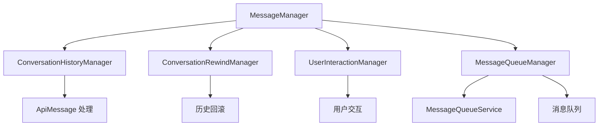

# Messaging 模块分析报告

## 概述

本报告对 `src/core/task/managers/messaging` 目录下的各个模块进行了深入分析，识别了潜在问题并提供了修改方案。

## 模块架构图



## 各模块分析

### 1. MessageManager.ts

#### 职责
管理 API 对话历史和 Cline 消息的存储、检索和持久化。

#### 发现的问题

**问题 1: 异步初始化未等待（严重）**
- **位置**: 第 38 行，构造函数中调用 `this.initializeConversationIndex()`
- **描述**: `initializeConversationIndex()` 是异步方法，但在构造函数中调用时没有使用 `await`，导致初始化可能在后续操作完成前才执行
- **影响**: 
  - `conversationIndexCounter` 可能在初始化完成前被使用
  - 可能导致索引重复或从 0 重新开始
  - 检查点恢复时可能丢失对话索引信息
- **代码示例**:
```typescript
constructor(options: MessageManagerOptions) {
    // ... 其他初始化
    this.initializeConversationIndex() // ❌ 未等待异步操作
}
```

**问题 2: conversationIndex 持久化缺失（严重）**
- **位置**: 整个文件
- **描述**: 虽然从历史中恢复 `conversationIndexCounter`，但在保存消息时没有持久化 `conversationIndex`
- **影响**:
  - 应用重启后，新消息的 `conversationIndex` 可能不连续
  - 检查点恢复时无法正确关联对话索引
- **代码示例**:
```typescript
async addToApiConversationHistory(message: ApiMessage, ...): Promise<void> {
    const messageWithTs = {
        ...message,
        ts: Date.now(),
        conversationIndex, // ✅ 设置了索引
    } as ApiMessage
    // ❌ 但保存时没有确保 conversationIndex 被持久化
}
```

**问题 3: conversationIndex 分配逻辑不一致（中等）**
- **位置**: 第 99-112 行
- **描述**: 只有 assistant 消息才分配 `conversationIndex`，但用户消息也应该有索引
- **影响**:
  - 无法准确追踪完整的对话轮次
  - 检查点恢复时可能缺少用户消息的索引信息
- **代码示例**:
```typescript
if (message.role === "assistant") {
    conversationIndex = this.currentRequestIndex
    // ❌ 用户消息没有分配 conversationIndex
}
```

**问题 4: 缺少错误处理（中等）**
- **位置**: 第 74-89 行
- **描述**: `initializeConversationIndex()` 中的错误处理只是打印警告，没有重试或降级策略
- **影响**: 初始化失败时，索引计数器重置为 0，可能导致索引冲突

#### 修改方案

**方案 1: 添加异步初始化方法**
```typescript
export class MessageManager {
    private initialized: boolean = false

    constructor(options: MessageManagerOptions) {
        this.stateManager = options.stateManager
        this.taskId = options.taskId
        this.globalStoragePath = options.globalStoragePath
        this.task = options.task
        this.eventBus = options.eventBus
    }

    /**
     * 异步初始化方法，必须在构造后调用
     */
    async initialize(): Promise<void> {
        await this.initializeConversationIndex()
        this.initialized = true
    }

    /**
     * 确保已初始化
     */
    private ensureInitialized(): void {
        if (!this.initialized) {
            throw new Error('[MessageManager] Not initialized. Call initialize() first.')
        }
    }

    // 在所有需要 conversationIndex 的方法开始处调用
    async addToApiConversationHistory(message: ApiMessage, ...): Promise<void> {
        this.ensureInitialized()
        // ... 其余逻辑
    }
}
```

**方案 2: 为所有消息分配 conversationIndex**
```typescript
async addToApiConversationHistory(message: ApiMessage, reasoning?: string, api?: any): Promise<void> {
    this.ensureInitialized()
    
    let conversationIndex: number | undefined
    
    if (message.role === "assistant") {
        // 响应消息继承当前请求索引
        conversationIndex = this.currentRequestIndex
        
        if (conversationIndex === undefined) {
            conversationIndex = this.conversationIndexCounter++
            console.warn(`[MessageManager] Assistant message without active request, assigned new index: ${conversationIndex}`)
        }
    } else if (message.role === "user") {
        // ✅ 用户消息也分配索引
        conversationIndex = this.conversationIndexCounter++
    }

    const messageWithTs = {
        ...message,
        ts: Date.now(),
        conversationIndex,
    } as ApiMessage

    // ... 其余逻辑
}
```

**方案 3: 添加 conversationIndex 持久化**
```typescript
async saveApiConversationHistory(): Promise<void> {
    // 确保所有消息都有 conversationIndex
    const messagesWithIndex = this.apiConversationHistory.map(msg => {
        if (msg.conversationIndex === undefined && msg.role) {
            return {
                ...msg,
                conversationIndex: this.conversationIndexCounter++
            }
        }
        return msg
    })
    
    await saveApiMessages({ 
        messages: messagesWithIndex, 
        taskId: this.taskId, 
        globalStoragePath: this.globalStoragePath 
    })
}
```

---

### 2. ConversationHistoryManager.ts

#### 职责
清理和转换 API 消息历史，移除推理块和特殊内容。

#### 发现的问题

**问题 1: 过度使用 `as any` 类型断言（严重）**
- **位置**: 第 71、142 行等多处
- **描述**: 大量使用 `as any` 绕过类型检查，降低了类型安全性
- **影响**:
  - 运行时可能出现类型错误
  - IDE 无法提供准确的类型提示
  - 重构时容易引入 bug
- **代码示例**:
```typescript
cleanConversationHistory.push({
    role: "assistant",
    content: assistantContent,
    reasoning_details: msgWithDetails.reasoning_details,
} as any) // ❌ 使用 any 绕过类型检查
```

**问题 2: 方法过于复杂（中等）**
- **位置**: 第 15-107 行，`buildCleanConversationHistory` 方法
- **描述**: 方法包含多个嵌套的条件分支，逻辑复杂难以维护
- **影响**:
  - 难以理解和测试
  - 容易引入 bug
  - 修改时可能影响其他分支

**问题 3: 缺少输入验证（中等）**
- **位置**: 第 15-107 行
- **描述**: 没有验证输入消息的格式和内容
- **影响**: 可能处理无效消息导致异常

**问题 4: 重复代码（轻微）**
- **位置**: 第 109-166 行，`cleanAssistantMessage` 方法
- **描述**: 与 `buildCleanConversationHistory` 中的逻辑重复
- **影响**: 维护成本高，修改需要同步两处

#### 修改方案

**方案 1: 定义正确的类型**
```typescript
// 定义扩展的消息类型
interface ExtendedMessageParam extends Anthropic.Messages.MessageParam {
    reasoning_details?: any[]
}

interface ReasoningMessageParam {
    type: "reasoning"
    encrypted_content: string
    id?: string
    summary?: any[]
}

// 使用联合类型
type CleanMessageParam = ExtendedMessageParam | ReasoningMessageParam

export class ConversationHistoryManager {
    public buildCleanConversationHistory(
        messages: ApiMessage[],
    ): CleanMessageParam[] {
        // ... 使用正确的类型，避免 as any
    }
}
```

**方案 2: 提取方法简化逻辑**
```typescript
export class ConversationHistoryManager {
    private processAssistantMessage(msg: ApiMessage): ExtendedMessageParam | null {
        const rawContent = msg.content
        const contentArray = this.normalizeContent(rawContent)
        const [first, ...rest] = contentArray

        // 处理 reasoning_details
        if (this.hasReasoningDetails(msg)) {
            return this.buildMessageWithReasoningDetails(msg, contentArray)
        }

        // 处理加密推理
        if (this.hasEncryptedReasoning(first)) {
            return {
                role: "assistant",
                content: rest.length === 0 ? "" : rest,
            }
        }

        // 处理思考块
        if (this.hasThinkingBlock(first)) {
            return {
                role: "assistant",
                content: rest.length === 0 ? "" : rest,
            }
        }

        return msg as ExtendedMessageParam
    }

    private normalizeContent(rawContent: any): Anthropic.Messages.ContentBlockParam[] {
        if (Array.isArray(rawContent)) {
            return rawContent as Anthropic.Messages.ContentBlockParam[]
        }
        if (rawContent !== undefined) {
            return [{
                type: "text",
                text: rawContent
            } satisfies Anthropic.Messages.TextBlockParam]
        }
        return []
    }

    private hasReasoningDetails(msg: ApiMessage): boolean {
        const msgWithDetails = msg as any
        return msgWithDetails.reasoning_details && Array.isArray(msgWithDetails.reasoning_details)
    }

    private hasEncryptedReasoning(first: any): boolean {
        return first && first.type === "reasoning" && typeof first.encrypted_content === "string"
    }

    private hasThinkingBlock(first: any): boolean {
        return first && first.type === "thinking" && typeof first.thinking === "string"
    }

    private buildMessageWithReasoningDetails(
        msg: ApiMessage,
        contentArray: Anthropic.Messages.ContentBlockParam[]
    ): ExtendedMessageParam {
        const msgWithDetails = msg as any
        let assistantContent: Anthropic.Messages.MessageParam["content"]

        if (contentArray.length === 0) {
            assistantContent = ""
        } else if (contentArray.length === 1 && contentArray[0].type === "text") {
            assistantContent = (contentArray[0] as Anthropic.Messages.TextBlockParam).text
        } else {
            assistantContent = contentArray
        }

        return {
            role: "assistant",
            content: assistantContent,
            reasoning_details: msgWithDetails.reasoning_details,
        }
    }
}
```

**方案 3: 添加输入验证**
```typescript
public buildCleanConversationHistory(messages: ApiMessage[]): CleanMessageParam[] {
    if (!Array.isArray(messages)) {
        throw new Error('[ConversationHistoryManager] messages must be an array')
    }

    const cleanConversationHistory: CleanMessageParam[] = []

    for (const msg of messages) {
        if (!msg || typeof msg !== 'object') {
            console.warn('[ConversationHistoryManager] Invalid message, skipping:', msg)
            continue
        }

        try {
            const cleaned = this.cleanMessage(msg)
            if (cleaned) {
                cleanConversationHistory.push(cleaned)
            }
        } catch (error) {
            console.error('[ConversationHistoryManager] Error cleaning message:', error)
            continue
        }
    }

    return cleanConversationHistory
}

private cleanMessage(msg: ApiMessage): CleanMessageParam | null {
    if (msg.type === "reasoning") {
        return this.cleanReasoningMessage(msg)
    }
    
    if (msg.role === "assistant") {
        return this.processAssistantMessage(msg)
    }
    
    if (msg.role) {
        return msg as ExtendedMessageParam
    }
    
    return null
}
```

---

### 3. ConversationRewindManager.ts

#### 职责
管理对话历史的回滚操作，支持按时间戳或索引回滚。

#### 发现的问题

**问题 1: 方法过于复杂（严重）**
- **位置**: 第 73-130 行，`truncateApiHistoryWithCleanup` 方法
- **描述**: 方法包含多个嵌套的条件和过滤逻辑，职责不清晰
- **影响**:
  - 难以理解和测试
  - 容易引入 bug
  - 修改时可能影响其他功能

**问题 2: 缺少边界条件处理（中等）**
- **位置**: 第 21-24 行
- **描述**: `rewindToTimestamp` 中如果找不到消息会抛出错误，但没有提供降级方案
- **影响**: 可能导致整个回滚操作失败

**问题 3: 高耦合度（中等）**
- **位置**: 整个文件
- **描述**: 直接依赖 `this.task.clineMessages` 和 `this.task.apiConversationHistory`
- **影响**:
  - 难以单独测试
  - 修改 Task 类可能影响此模块

**问题 4: 缺少事务性（中等）**
- **位置**: 第 36-44 行
- **描述**: 回滚操作分多步执行，如果中间失败可能导致数据不一致
- **影响**: 可能导致消息历史处于不一致状态

#### 修改方案

**方案 1: 拆分复杂方法**
```typescript
export class ConversationRewindManager {
    private async performRewind(toIndex: number, cutoffTs: number, options: RewindOptions): Promise<void> {
        const { skipCleanup = false } = options

        // 1. 收集需要移除的上下文事件 ID
        const removedIds = this.collectRemovedContextEventIds(toIndex)

        // 2. 截断 clineMessages
        await this.truncateClineMessages(toIndex)

        // 3. 计算实际的截止时间戳
        const actualCutoff = this.calculateActualCutoff(cutoffTs)

        // 4. 截断 API 历史并清理
        await this.truncateApiHistoryWithCleanup(actualCutoff, removedIds, skipCleanup)
    }

    private calculateActualCutoff(cutoffTs: number): number {
        const apiHistory = this.task.apiConversationHistory
        const hasExactMatch = apiHistory.some((m) => m.ts === cutoffTs)
        const hasMessageBeforeCutoff = apiHistory.some((m) => m.ts !== undefined && m.ts < cutoffTs)

        if (!hasExactMatch && hasMessageBeforeCutoff) {
            const firstUserMsgIndexToRemove = apiHistory.findIndex(
                (m) => m.ts !== undefined && m.ts >= cutoffTs && m.role === "user",
            )

            if (firstUserMsgIndexToRemove !== -1) {
                return apiHistory[firstUserMsgIndexToRemove].ts!
            }
        }

        return cutoffTs
    }

    private async truncateApiHistoryWithCleanup(
        cutoffTs: number,
        removedIds: ContextEventIds,
        skipCleanup: boolean,
    ): Promise<void> {
        const originalHistory = this.task.apiConversationHistory
        
        // 1. 按时间戳过滤
        let apiHistory = this.filterByTimestamp(originalHistory, cutoffTs)

        // 2. 移除孤立的摘要
        apiHistory = this.removeOrphanedSummaries(apiHistory, removedIds.condenseIds)

        // 3. 移除孤立的截断标记
        apiHistory = this.removeOrphanedTruncationMarkers(apiHistory, removedIds.truncationIds)

        // 4. 清理（如果需要）
        if (!skipCleanup) {
            apiHistory = cleanupAfterTruncation(apiHistory)
        }

        // 5. 保存（仅当有变化时）
        await this.saveIfChanged(apiHistory, originalHistory)
    }

    private filterByTimestamp(history: ApiMessage[], cutoffTs: number): ApiMessage[] {
        return history.filter((m) => !m.ts || m.ts < cutoffTs)
    }

    private removeOrphanedSummaries(history: ApiMessage[], condenseIds: Set<string>): ApiMessage[] {
        if (condenseIds.size === 0) {
            return history
        }

        return history.filter((msg) => {
            if (msg.isSummary && msg.condenseId && condenseIds.has(msg.condenseId)) {
                console.log(`[ConversationRewindManager] Removing orphaned Summary with condenseId: ${msg.condenseId}`)
                return false
            }
            return true
        })
    }

    private removeOrphanedTruncationMarkers(history: ApiMessage[], truncationIds: Set<string>): ApiMessage[] {
        if (truncationIds.size === 0) {
            return history
        }

        return history.filter((msg) => {
            if (msg.isTruncationMarker && msg.truncationId && truncationIds.has(msg.truncationId)) {
                console.log(`[ConversationRewindManager] Removing orphaned truncation marker with truncationId: ${msg.truncationId}`)
                return false
            }
            return true
        })
    }

    private async saveIfChanged(newHistory: ApiMessage[], originalHistory: ApiMessage[]): Promise<void> {
        const historyChanged =
            newHistory.length !== originalHistory.length || 
            newHistory.some((msg, i) => msg !== originalHistory[i])

        if (historyChanged) {
            await this.task.overwriteApiConversationHistory(newHistory)
        }
    }
}
```

**方案 2: 添加降级处理**
```typescript
async rewindToTimestamp(ts: number, options: RewindOptions = {}): Promise<void> {
    const { includeTargetMessage = false, skipCleanup = false } = options

    const clineIndex = this.task.clineMessages.findIndex((m: ClineMessage) => m.ts === ts)
    
    if (clineIndex === -1) {
        // 尝试找到最接近的消息
        const closestIndex = this.findClosestMessageIndex(ts)
        if (closestIndex !== -1) {
            console.warn(`[ConversationRewindManager] Message with timestamp ${ts} not found, using closest message at ${this.task.clineMessages[closestIndex].ts}`)
            const cutoffIndex = includeTargetMessage ? closestIndex + 1 : closestIndex
            await this.performRewind(cutoffIndex, this.task.clineMessages[closestIndex].ts, { skipCleanup })
            return
        }
        
        throw new Error(`Message with timestamp ${ts} not found in clineMessages`)
    }

    const cutoffIndex = includeTargetMessage ? clineIndex + 1 : clineIndex
    await this.performRewind(cutoffIndex, ts, { skipCleanup })
}

private findClosestMessageIndex(ts: number): number {
    let closestIndex = -1
    let minDiff = Infinity

    for (let i = 0; i < this.task.clineMessages.length; i++) {
        const diff = Math.abs(this.task.clineMessages[i].ts - ts)
        if (diff < minDiff) {
            minDiff = diff
            closestIndex = i
        }
    }

    return closestIndex
}
```

**方案 3: 降低耦合度**
```typescript
export interface RewindDependencies {
    getClineMessages: () => ClineMessage[]
    getApiConversationHistory: () => ApiMessage[]
    overwriteClineMessages: (messages: ClineMessage[]) => Promise<void>
    overwriteApiConversationHistory: (messages: ApiMessage[]) => Promise<void>
}

export class ConversationRewindManager {
    constructor(private dependencies: RewindDependencies) {}

    private get clineMessages(): ClineMessage[] {
        return this.dependencies.getClineMessages()
    }

    private get apiConversationHistory(): ApiMessage[] {
        return this.dependencies.getApiConversationHistory()
    }

    private async truncateClineMessages(toIndex: number): Promise<void> {
        await this.dependencies.overwriteClineMessages(this.clineMessages.slice(0, toIndex))
    }

    private async overwriteApiConversationHistory(apiHistory: ApiMessage[]): Promise<void> {
        await this.dependencies.overwriteApiConversationHistory(apiHistory)
    }
}
```

---

### 4. MessageQueueManager.ts

#### 职责
管理用户消息队列，处理消息提交和队列状态。

#### 发现的问题

**问题 1: setTimeout 延迟处理可能导致消息丢失（严重）**
- **位置**: 第 69-78 行，`processQueuedMessages` 方法
- **描述**: 使用 `setTimeout` 延迟 100ms 处理消息，但没有错误处理和重试机制
- **影响**:
  - 如果 `submitUserMessage` 失败，消息会丢失
  - 没有重试机制
  - 队列状态可能不一致
- **代码示例**:
```typescript
public async processQueuedMessages(): Promise<void> {
    if (!this.messageQueueService.isEmpty()) {
        const queued = this.messageQueueService.dequeueMessage()
        if (queued) {
            setTimeout(() => {
                this.submitUserMessage(queued.text, queued.images) // ❌ 没有错误处理
            }, 100)
        }
    }
}
```

**问题 2: 缺少队列满的处理（中等）**
- **位置**: 整个文件
- **描述**: 没有队列大小限制，可能导致内存问题
- **影响**:
  - 用户可以无限添加消息到队列
  - 可能导致内存溢出

**问题 3: WeakRef 可能丢失引用（轻微）**
- **位置**: 第 47 行
- **描述**: 使用 `WeakRef` 存储 provider 引用，可能被垃圾回收
- **影响**: 消息可能无法提交

#### 修改方案

**方案 1: 添加错误处理和重试机制**
```typescript
export class MessageQueueManager {
    private maxRetries: number = 3
    private retryDelay: number = 1000
    private processing: boolean = false

    public async processQueuedMessages(): Promise<void> {
        if (this.processing || this.messageQueueService.isEmpty()) {
            return
        }

        this.processing = true

        try {
            const queued = this.messageQueueService.dequeueMessage()
            if (queued) {
                await this.processMessageWithRetry(queued, 0)
            }
        } catch (error) {
            console.error('[MessageQueueManager#processQueuedMessages] Error processing queue:', error)
        } finally {
            this.processing = false
        }
    }

    private async processMessageWithRetry(queued: QueuedMessage, retryCount: number): Promise<void> {
        try {
            await this.submitUserMessage(queued.text, queued.images)
        } catch (error) {
            console.error(`[MessageQueueManager] Failed to submit message (attempt ${retryCount + 1}):`, error)
            
            if (retryCount < this.maxRetries) {
                // 重新加入队列
                this.messageQueueService.addMessage(queued.text, queued.images)
                
                // 延迟重试
                await new Promise(resolve => setTimeout(resolve, this.retryDelay * (retryCount + 1)))
                
                // 重新处理
                await this.processQueuedMessages()
            } else {
                console.error('[MessageQueueManager] Max retries exceeded, message dropped:', queued)
            }
        }
    }
}
```

**方案 2: 添加队列大小限制**
```typescript
export interface MessageQueueManagerOptions {
    taskId: string
    providerRef: WeakRef<ClineProvider>
    onUserMessage?: (taskId: string) => void
    maxQueueSize?: number // ✅ 添加队列大小限制
}

export class MessageQueueManager {
    private maxQueueSize: number

    constructor(options: MessageQueueManagerOptions) {
        this.taskId = options.taskId
        this.providerRef = options.providerRef
        this.onUserMessage = options.onUserMessage
        this.maxQueueSize = options.maxQueueSize ?? 10 // 默认最多 10 条消息

        // ... 其余初始化
    }

    public async submitUserMessage(
        text: string,
        images: string[] = [],
        mode?: string,
        providerProfile?: string,
    ): Promise<void> {
        try {
            text = (text ?? "").trim()
            images = images ?? []

            if (text.length === 0 && images.length === 0) {
                return
            }

            // ✅ 检查队列是否已满
            if (this.messageQueueService.messages.length >= this.maxQueueSize) {
                console.warn('[MessageQueueManager] Queue is full, rejecting message')
                return
            }

            const provider = this.providerRef.deref()

            if (provider) {
                if (mode) {
                    await provider.setMode(mode)
                }

                if (providerProfile) {
                    await provider.setProviderProfile(providerProfile)
                }

                this.onUserMessage?.(this.taskId)

                provider.postMessageToWebview({ type: "invoke", invoke: "sendMessage", text, images })
            } else {
                console.error("[MessageQueueManager#submitUserMessage] Provider reference lost")
            }
        } catch (error) {
            console.error("[MessageQueueManager#submitUserMessage] Failed to submit user message:", error)
        }
    }
}
```

---

### 5. MessageQueueService.ts

#### 职责
提供消息队列的核心功能，包括添加、移除、更新和出队操作。

#### 发现的问题

**问题 1: 缺少队列大小限制（中等）**
- **位置**: 整个文件
- **描述**: 没有队列大小限制，可能导致内存问题
- **影响**:
  - 可以无限添加消息
  - 可能导致内存溢出

**问题 2: 缺少消息去重机制（轻微）**
- **位置**: 第 36-52 行，`addMessage` 方法
- **描述**: 没有检查重复消息
- **影响**: 可能添加相同的消息多次

**问题 3: 缺少持久化支持（中等）**
- **位置**: 整个文件
- **描述**: 消息只存储在内存中，应用崩溃时会丢失
- **影响**:
  - 应用崩溃时队列中的消息会丢失
  - 用户体验差

#### 修改方案

**方案 1: 添加队列大小限制**
```typescript
export interface MessageQueueServiceOptions {
    maxSize?: number
}

export class MessageQueueService extends EventEmitter<QueueEvents> {
    private _messages: QueuedMessage[]
    private maxSize: number

    constructor(options: MessageQueueServiceOptions = {}) {
        super()
        this._messages = []
        this.maxSize = options.maxSize ?? 10 // 默认最多 10 条消息
    }

    public addMessage(text: string, images?: string[]): QueuedMessage | undefined {
        if (!text && !images?.length) {
            return undefined
        }

        // ✅ 检查队列是否已满
        if (this._messages.length >= this.maxSize) {
            console.warn('[MessageQueueService] Queue is full, cannot add message')
            return undefined
        }

        const message: QueuedMessage = {
            timestamp: Date.now(),
            id: uuidv4(),
            text,
            images,
        }

        this._messages.push(message)
        this.emit("stateChanged", this._messages)

        return message
    }
}
```

**方案 2: 添加消息去重**
```typescript
export class MessageQueueService extends EventEmitter<QueueEvents> {
    private _messages: QueuedMessage[]

    public addMessage(text: string, images?: string[]): QueuedMessage | undefined {
        if (!text && !images?.length) {
            return undefined
        }

        // ✅ 检查是否已存在相同的消息
        const isDuplicate = this._messages.some(msg => 
            msg.text === text && 
            JSON.stringify(msg.images) === JSON.stringify(images)
        )

        if (isDuplicate) {
            console.warn('[MessageQueueService] Duplicate message, skipping')
            return undefined
        }

        // ... 其余逻辑
    }
}
```

**方案 3: 添加持久化支持**
```typescript
export interface MessageQueueServiceOptions {
    maxSize?: number
    persistKey?: string // 用于持久化的键
}

export class MessageQueueService extends EventEmitter<QueueEvents> {
    private _messages: QueuedMessage[]
    private maxSize: number
    private persistKey?: string

    constructor(options: MessageQueueServiceOptions = {}) {
        super()
        this._messages = []
        this.maxSize = options.maxSize ?? 10
        this.persistKey = options.persistKey

        // ✅ 从持久化存储恢复
        if (this.persistKey) {
            this.loadFromPersistence()
        }
    }

    private loadFromPersistence(): void {
        try {
            const saved = localStorage.getItem(this.persistKey!)
            if (saved) {
                this._messages = JSON.parse(saved)
                console.log(`[MessageQueueService] Loaded ${this._messages.length} messages from persistence`)
            }
        } catch (error) {
            console.error('[MessageQueueService] Failed to load from persistence:', error)
        }
    }

    private saveToPersistence(): void {
        if (!this.persistKey) {
            return
        }

        try {
            localStorage.setItem(this.persistKey, JSON.stringify(this._messages))
        } catch (error) {
            console.error('[MessageQueueService] Failed to save to persistence:', error)
        }
    }

    public addMessage(text: string, images?: string[]): QueuedMessage | undefined {
        // ... 添加消息逻辑

        this._messages.push(message)
        this.emit("stateChanged", this._messages)

        // ✅ 保存到持久化存储
        this.saveToPersistence()

        return message
    }

    public dequeueMessage(): QueuedMessage | undefined {
        const message = this._messages.shift()
        this.emit("stateChanged", this._messages)

        // ✅ 保存到持久化存储
        this.saveToPersistence()

        return message
    }

    public dispose(): void {
        this._messages = []
        this.removeAllListeners()
        
        // ✅ 清除持久化存储
        if (this.persistKey) {
            try {
                localStorage.removeItem(this.persistKey)
            } catch (error) {
                console.error('[MessageQueueService] Failed to clear persistence:', error)
            }
        }
    }
}
```

---

### 6. UserInteractionManager.ts

#### 职责
管理用户交互，包括 ask 和 say 操作，处理用户响应。

#### 发现的问题

**问题 1: 轮询方式效率低下（严重）**
- **位置**: 第 127-139 行，`waitForResponse` 方法
- **描述**: 使用 `setTimeout` 轮询检查响应，每 100ms 检查一次
- **影响**:
  - CPU 使用率高
  - 响应延迟
  - 不符合现代异步编程模式
- **代码示例**:
```typescript
private async waitForResponse(askTs: number): Promise<void> {
    return new Promise((resolve) => {
        const checkResponse = () => {
            if (this.lastMessageTs !== askTs) {
                this.waitForResponseTimeoutRef = undefined
                resolve()
            } else {
                this.waitForResponseTimeoutRef = setTimeout(checkResponse, 100) // ❌ 轮询
            }
        }
        checkResponse()
    })
}
```

**问题 2: 缺少超时机制（严重）**
- **位置**: 第 127-139 行
- **描述**: `waitForResponse` 没有超时机制，可能永远等待
- **影响**:
  - 如果用户不响应，任务会永远挂起
  - 资源泄漏

**问题 3: 状态管理不清晰（中等）**
- **位置**: 第 23-26 行
- **描述**: 多个状态变量（`askResponse`、`askResponseText`、`askResponseImages`）管理混乱
- **影响**:
  - 容易出现状态不一致
  - 难以追踪状态变化

**问题 4: timeout 引用管理不当（中等）**
- **位置**: 第 27-28 行，第 299-304 行
- **描述**: `waitForResponseTimeoutRef` 在 dispose 时清理，但没有在正常完成时清理
- **影响**:
  - 可能导致内存泄漏
  - 多次调用时可能冲突

#### 修改方案

**方案 1: 使用 Promise 替代轮询**
```typescript
export class UserInteractionManager {
    private responseResolvers: Map<number, (value: void) => void> = new Map()

    private async waitForResponse(askTs: number, timeout: number = 30000): Promise<void> {
        return new Promise((resolve, reject) => {
            // 设置超时
            const timeoutRef = setTimeout(() => {
                this.responseResolvers.delete(askTs)
                reject(new Error(`[UserInteractionManager] Response timeout after ${timeout}ms`))
            }, timeout)

            // 存储 resolver
            this.responseResolvers.set(askTs, () => {
                clearTimeout(timeoutRef)
                resolve()
            })

            // 检查是否已经有响应
            if (this.lastMessageTs !== askTs) {
                this.responseResolvers.get(askTs)?.()
            }
        })
    }

    handleWebviewAskResponse(askResponse: ClineAskResponse, text?: string, images?: string[]): void {
        this.askResponse = askResponse
        this.askResponseText = text
        this.askResponseImages = images

        if (askResponse === "messageResponse" || askResponse === "yesButtonClicked") {
            this.lastMessageTs = Date.now()
        }

        if (this.terminalAsk || this.resumableAsk || this.interactiveAsk) {
            this.terminalAsk = undefined
            this.resumableAsk = undefined
            this.interactiveAsk = undefined
        }

        // ✅ 触发等待的 Promise
        if (this.lastMessageTs) {
            const resolver = this.responseResolvers.get(this.lastMessageTs)
            if (resolver) {
                resolver()
                this.responseResolvers.delete(this.lastMessageTs)
            }
        }
    }
}
```

**方案 2: 改进状态管理**
```typescript
interface AskState {
    askResponse?: ClineAskResponse
    askResponseText?: string
    askResponseImages?: string[]
    timestamp: number
}

export class UserInteractionManager {
    private askState: AskState | null = null
    private responseResolvers: Map<number, (value: void) => void> = new Map()

    private async waitForApproval(
        type: ClineAsk,
        message?: string,
        images?: string[],
    ): Promise<{ decision: "approve" | "deny" }> {
        const askTs = Date.now()
        const isBlocking = isBlockingAsk(type)
        const isStatusMutable = isMutableAsk(type)

        const askMessage: ClineMessage = {
            type: "ask",
            ask: type,
            ts: askTs,
            text: message,
            images,
        }

        await this.messageManager.addToClineMessages(askMessage)

        if (isBlocking) {
            if (isStatusMutable) {
                if (type === "resume_task") {
                    this.resumableAsk = askMessage
                } else if (type === "command") {
                    this.interactiveAsk = askMessage
                }
            } else if (isTerminalAsk(type)) {
                this.terminalAsk = askMessage
            } else {
                this.interactiveAsk = askMessage
            }

            // ✅ 初始化状态
            this.askState = {
                timestamp: askTs,
            }

            await this.waitForResponse(askTs)
        }

        return { decision: "approve" }
    }

    handleWebviewAskResponse(askResponse: ClineAskResponse, text?: string, images?: string[]): void {
        // ✅ 更新状态
        if (this.askState) {
            this.askState.askResponse = askResponse
            this.askState.askResponseText = text
            this.askState.askResponseImages = images
        }

        if (askResponse === "messageResponse" || askResponse === "yesButtonClicked") {
            this.lastMessageTs = Date.now()
        }

        if (this.terminalAsk || this.resumableAsk || this.interactiveAsk) {
            this.terminalAsk = undefined
            this.resumableAsk = undefined
            this.interactiveAsk = undefined
        }

        // 触发等待的 Promise
        if (this.lastMessageTs) {
            const resolver = this.responseResolvers.get(this.lastMessageTs)
            if (resolver) {
                resolver()
                this.responseResolvers.delete(this.lastMessageTs)
            }
        }
    }

    dispose(): void {
        // 清理所有等待的 Promise
        this.responseResolvers.forEach((resolver) => {
            resolver()
        })
        this.responseResolvers.clear()

        // 清理状态
        this.terminalAsk = undefined
        this.resumableAsk = undefined
        this.interactiveAsk = undefined
        this.askState = null
        this.lastMessageTs = undefined
    }
}
```

**方案 3: 添加超时配置**
```typescript
export interface UserInteractionManagerOptions {
    stateManager: TaskStateManager
    messageManager: MessageManager
    responseTimeout?: number // 响应超时时间（毫秒）
}

export class UserInteractionManager {
    private stateManager: TaskStateManager
    private messageManager: MessageManager
    private responseTimeout: number

    constructor(options: UserInteractionManagerOptions) {
        this.stateManager = options.stateManager
        this.messageManager = options.messageManager
        this.responseTimeout = options.responseTimeout ?? 30000 // 默认 30 秒
    }

    private async waitForResponse(askTs: number): Promise<void> {
        return new Promise((resolve, reject) => {
            const timeoutRef = setTimeout(() => {
                this.responseResolvers.delete(askTs)
                reject(new Error(`[UserInteractionManager] Response timeout after ${this.responseTimeout}ms`))
            }, this.responseTimeout)

            this.responseResolvers.set(askTs, () => {
                clearTimeout(timeoutRef)
                resolve()
            })

            if (this.lastMessageTs !== askTs) {
                this.responseResolvers.get(askTs)?.()
            }
        })
    }
}
```

---

## 总结

### 严重问题（必须修复）

1. **MessageManager.ts**: 异步初始化未等待，可能导致索引冲突
2. **MessageManager.ts**: conversationIndex 持久化缺失
3. **MessageQueueManager.ts**: setTimeout 延迟处理可能导致消息丢失
4. **UserInteractionManager.ts**: 轮询方式效率低下
5. **UserInteractionManager.ts**: 缺少超时机制

### 中等问题（建议修复）

1. **ConversationHistoryManager.ts**: 过度使用 `as any` 类型断言
2. **ConversationHistoryManager.ts**: 方法过于复杂
3. **ConversationRewindManager.ts**: 方法过于复杂
4. **ConversationRewindManager.ts**: 缺少边界条件处理
5. **MessageQueueService.ts**: 缺少队列大小限制
6. **MessageQueueService.ts**: 缺少持久化支持

### 轻微问题（可选修复）

1. **ConversationHistoryManager.ts**: 重复代码
2. **ConversationRewindManager.ts**: 高耦合度
3. **MessageQueueService.ts**: 缺少消息去重机制
4. **UserInteractionManager.ts**: 状态管理不清晰

### 优先级建议

**高优先级**（立即修复）:
1. MessageManager 异步初始化问题
2. MessageManager conversationIndex 持久化
3. UserInteractionManager 轮询和超时问题
4. MessageQueueManager 错误处理

**中优先级**（近期修复）:
1. ConversationHistoryManager 类型安全
2. ConversationRewindManager 方法拆分
3. MessageQueueService 队列限制和持久化

**低优先级**（后续优化）:
1. 代码重构和去重
2. 降低耦合度
3. 添加更多测试

### 测试建议

1. 为每个模块添加单元测试
2. 添加集成测试验证模块间交互
3. 添加边界条件测试
4. 添加错误场景测试
5. 添加性能测试（特别是轮询机制）

### 文档建议

1. 为每个公共方法添加 JSDoc 注释
2. 添加使用示例
3. 说明异步操作的注意事项
4. 说明错误处理策略