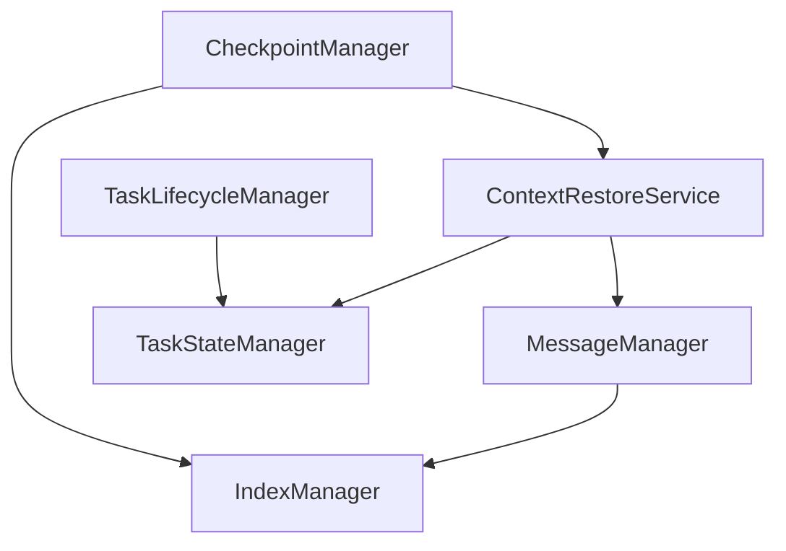

# 模块组织结构建议

## 一、当前目录结构分析

```
src/core/task/managers/
├── core/                          # 核心管理器（已存在）
│   ├── SubtaskManager.ts         # 子任务管理
│   ├── TaskLifecycleManager.ts   # 任务生命周期管理
│   └── TaskStateManager.ts       # 任务状态管理
├── checkpoint/                    # 检查点管理
│   └── CheckpointManager.ts
├── messaging/                     # 消息管理
│   ├── MessageManager.ts
│   ├── ConversationHistoryManager.ts
│   └── ConversationRewindManager.ts
└── context/                       # 上下文管理
    └── ContextManager.ts
```

## 二、建议的通用模块组织

### 方案A：扩展 core 目录（推荐）

```
src/core/task/managers/core/
├── SubtaskManager.ts              # 已存在
├── TaskLifecycleManager.ts        # 已存在
├── TaskStateManager.ts            # 已存在
├── IndexManager.ts                # 新增：统一索引管理
└── ContextRestoreService.ts       # 新增：上下文恢复服务
```

**理由**：
- `core` 目录已包含核心管理器，新增的通用模块符合"核心"定位
- `IndexManager` 和 `ContextRestoreService` 被多个模块依赖，属于核心基础设施
- 保持现有架构的一致性

---

### 方案B：创建 shared 目录

```
src/core/task/managers/
├── core/                          # 核心管理器
├── shared/                        # 新增：共享服务
│   ├── IndexManager.ts
│   ├── ContextRestoreService.ts
│   └── CheckpointMetadataManager.ts
├── checkpoint/
├── messaging/
└── context/
```

**理由**：
- 明确区分"核心管理器"和"共享服务"
- 便于未来添加更多共享组件
- 职责边界更清晰

---

### 方案C：按功能域组织

```
src/core/task/managers/
├── core/                          # 核心管理器
├── checkpoint/                    # 检查点域
│   ├── CheckpointManager.ts
│   ├── CheckpointRestoreCoordinator.ts  # 新增
│   └── CheckpointMetadataManager.ts     # 新增
├── context/                       # 上下文域
│   ├── ContextManager.ts
│   ├── ContextRestoreService.ts   # 新增
│   └── ContextManagementStrategy.ts    # 新增
├── messaging/                     # 消息域
│   ├── MessageManager.ts
│   ├── ConversationHistoryManager.ts
│   └── IndexManager.ts            # 新增
└── execution/                     # 执行域
    └── ...
```

**理由**：
- 按功能域组织，职责清晰
- 便于功能模块的独立开发和维护
- 符合领域驱动设计（DDD）思想

---

## 三、推荐方案：方案A（扩展 core 目录）

### 3.1 目录结构

```
src/core/task/managers/core/
├── SubtaskManager.ts              # 子任务管理
├── TaskLifecycleManager.ts        # 任务生命周期管理
├── TaskStateManager.ts            # 任务状态管理
├── IndexManager.ts                # 统一索引管理
└── ContextRestoreService.ts       # 上下文恢复服务
```

### 3.2 模块职责

| 模块 | 职责 | 依赖 |
|------|------|------|
| `SubtaskManager` | 子任务委托和恢复 | Task, Provider |
| `TaskLifecycleManager` | 任务启动、恢复、中止 | Task, Provider |
| `TaskStateManager` | 任务状态管理 | Provider |
| `IndexManager` | 统一索引管理（对话索引、请求索引、检查点索引） | MessageManager, CheckpointManager |
| `ContextRestoreService` | 统一上下文恢复逻辑 | MessageManager, TaskStateManager |

### 3.3 依赖关系



---

## 四、其他模块的组织建议

### 4.1 检查点相关模块

```
src/core/checkpoints/
├── CheckpointDecisionEngine.ts    # 已存在
├── CheckpointRestoreCoordinator.ts  # 新增：恢复协调器
├── CheckpointMetadataManager.ts   # 新增：元数据管理
└── types.ts                       # 已存在
```

### 4.2 上下文管理相关模块

```
src/core/context-management/
├── index.ts                       # 已存在：核心管理逻辑
├── ContextManagementStrategy.ts   # 新增：策略接口
├── strategies/
│   ├── CondenseStrategy.ts        # 新增：压缩策略
│   └── TruncateStrategy.ts        # 新增：截断策略
└── ContextRestoreService.ts       # 新增：恢复服务（或放在 core/）
```

---

## 五、迁移路径

### 阶段1：创建核心服务（1-2周）

1. 创建 `src/core/task/managers/core/IndexManager.ts`
2. 创建 `src/core/task/managers/core/ContextRestoreService.ts`
3. 添加单元测试

### 阶段2：迁移现有逻辑（2-3周）

1. 更新 `MessageManager` 使用 `IndexManager`
2. 更新 `CheckpointManager` 使用 `IndexManager` 和 `ContextRestoreService`
3. 删除重复代码

### 阶段3：创建协调器（1-2周）

1. 创建 `src/core/checkpoints/CheckpointRestoreCoordinator.ts`
2. 更新 `checkpointRestoreHandler.ts` 使用协调器
3. 添加集成测试

### 阶段4：实现策略模式（2-3周）

1. 创建 `src/core/context-management/ContextManagementStrategy.ts`
2. 实现策略类
3. 重构 `ContextManager` 使用策略

---

## 六、总结

### 推荐方案

**方案A：扩展 core 目录**

**优势**：
- 最小化架构变更
- 保持现有结构一致性
- 核心服务集中管理

**实施优先级**：
1. **高优先级**：`IndexManager`、`ContextRestoreService`
2. **中优先级**：`CheckpointRestoreCoordinator`、`ContextManagementStrategy`
3. **低优先级**：`CheckpointMetadataManager`

### 关键原则

1. **单一职责**：每个模块只负责一个明确的功能
2. **依赖倒置**：高层模块不依赖低层模块，都依赖抽象
3. **开闭原则**：对扩展开放，对修改关闭
4. **接口隔离**：使用细粒度的接口

### 预期收益

- **代码复用**：消除重复代码，提高复用性
- **可维护性**：清晰的职责边界，便于维护
- **可测试性**：模块化设计，便于单元测试
- **可扩展性**：便于添加新功能和策略